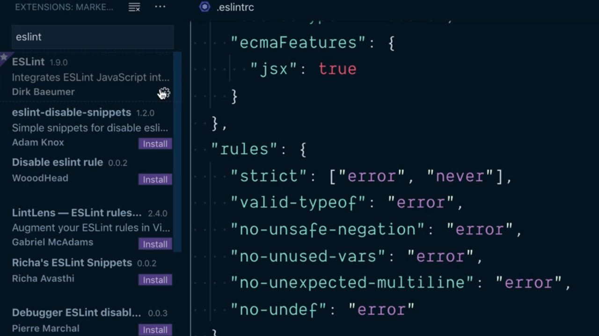
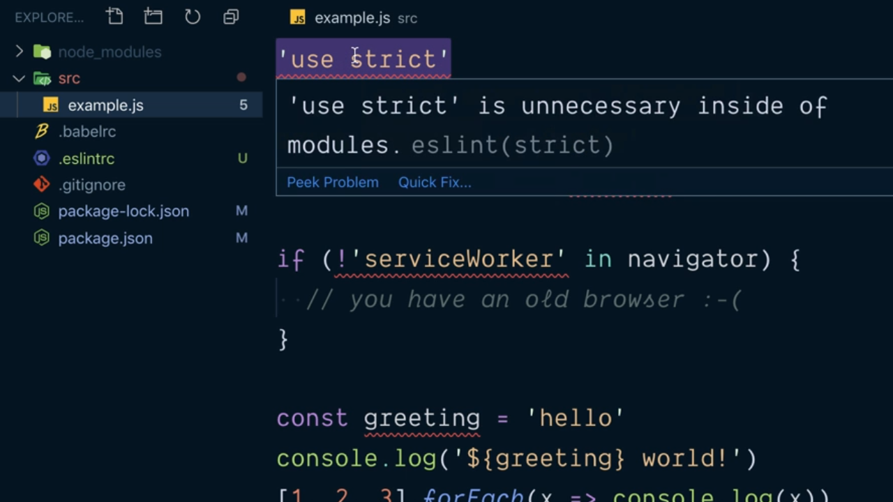
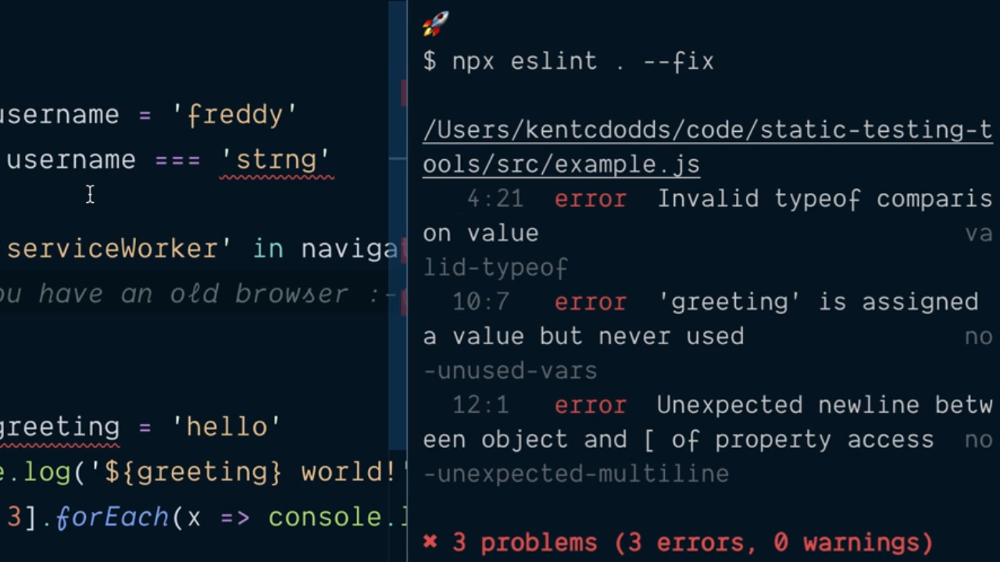
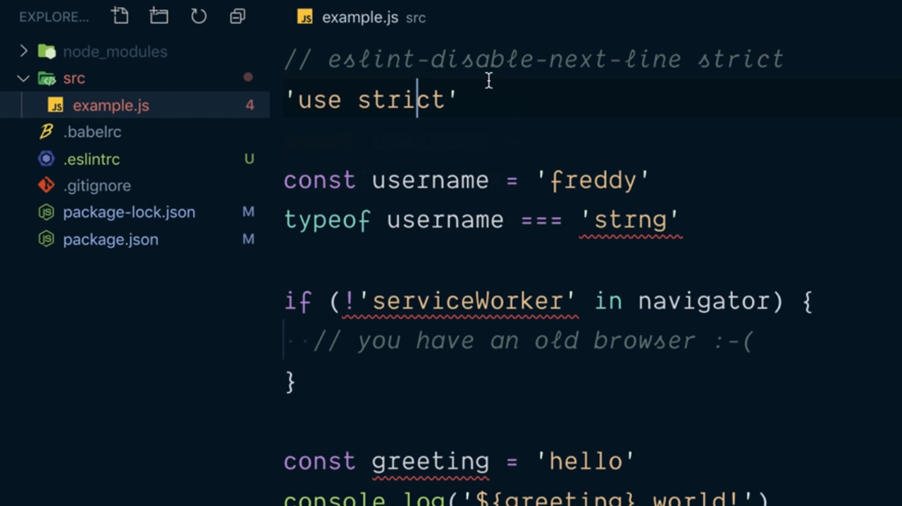
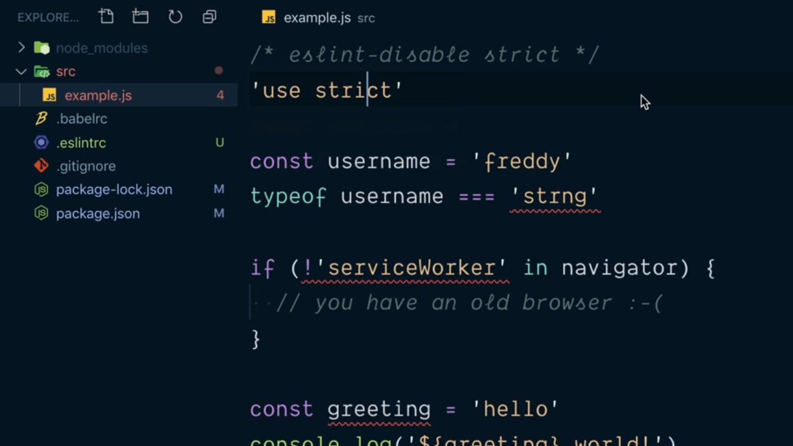

# Use the eslint Extension for VSCode.

Para la mayoría de los editores de código que podemos utilizar en el día a día para el desarrollo de nuestras aplicaciones tenemos la posibilidad de añadir un plugin o extensión que nos permita trabajar con eslint. 

En el caso de VSCode podemos encontrar la extensión que nos va a permitir con esta herramienta si en la búsqueda de extensiones escribimos *eslint* e instalamos la primera de las extensiones que se nos ofrecen en los resultados de búsqueda:

<div style='text-align: center'>
  
</div>
<br />

Una vez tenemos instalada la extensión y habilitada si ahora nos vamos a cualquiera de los archivos JavaScript de nuestro proyecto en el que pueda haber algún tipo de error VSCode nos mostrará en subrayado en rojo el lugar en concreto en el que existe el error de tal manera que si situamos el ratón sobre el mismo mediante un tool-tip vamos a obtener una descripción más detallada de cuál es el problema concreto:

<div style='text-align: center'>
  
</div>
<br />

De esta manera cuando estamos trabajando en el desarrollo de uno de los ficheros de nuestro proyecto podremos obtener información de los posibles errores de análisi de código estático mientras estamos trabajando lo que nos va a permitir ahorrarnos tener que ejecutar el eslint desde la línea de comandos además de asegurarnos de que los errores son más infrecuentes porque en el momento en el que aparecerán vamos a poderlos corregir.

Una de las características más interesantes de esta extensión es que asociado a cada error que se nos prensente en el código vamos a tener la posibilidad de desplegar un menú contextual como el que se muestra en la siguiente imagen (en el caso de un sistema macOS este aparece pulsando sobre las teclas `cmd + .`):

<div style='text-align: center'>
  
</div>
<br />

Así, si elegimos la primera de las opciones que nos ofrecen lo que hará la extensión por nosotros es corregir el problema por nosotros que en este caso será eliminar la instrucción del código fuente recogido en el archivo.

¿Existe la posibilidad realizar estas tareas de autocorreción desde la líneas de comandos de una forma automática (sin nuestra interacción)? La respuesta es que sí, simplemente indicando el flag `--fix` cuando estamos invocando a eslint:

```console
$ npx eslint . --fix
```

En la siguiente imagen podemos ver el resultado de la ejecución donde además podemos comprobar como en el código fuente del archivo se han realizado las correcciones de forma automática decrementando el número de errores derivados del análisis de código estático de forma considerable:

<div style='text-align: center'>
  
</div>
<br />

La segunda de las opciones que nos ofrece el menú contextual de la extensión de eslint para VSCode lo que nos va a permitir es deshabilitar la regla que se está verificando para esa línea de código concreta lo que se traduce en que se va a introducir un comentario siguiendo una sintaxis concreta que eslint va a poder interprestar y por lo tanto determinar que no ha de verificar la regla:

<div style='text-align: center'>
  
</div>
<br />

La otra posibilidad que nos ofrece el menú  contextual es deshabilitar la regla que se está violando para todo el fichero lo que hace que se introduzca un comentario que puede ser interpretado de igual manera por eslint pero en este caso sabiendo que la regla no ha de ser tenida en cuenta en el conjunto entero del fichero y no solamente en la línea que le sigue:

<div style='text-align: center'>
  
</div>
<br />

Con esto podemos comprobar como la extensión para eslint nos va a permitir centarnos más en lo que es el desarrollo en sí de nuestro código y no en los posibles errores derivados de los problemas derivados del análisis de código estático porque eslint nos los irá reportando de forma automática.

<br />

----
<div>
  <div style="float: left">
    <a href="https://github.com/DevJoseManuel/js-tutorials/blob/master/testing/ch01/02_02.md">
      < Lint JavaScript by Configuring and Running eslint
    </a>
  </div>
  <div style="float: right">
    <a href="https://github.com/DevJoseManuel/js-tutorials/blob/master/testing/ch02/02_04.md">
      Use Pre Built eslint Configuration >
    </a>
  </div>
</div>
