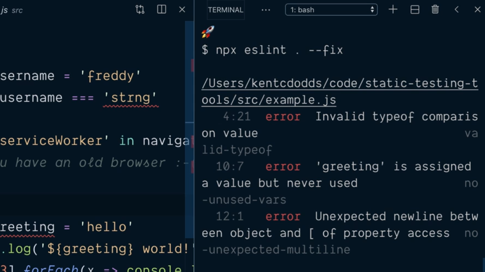
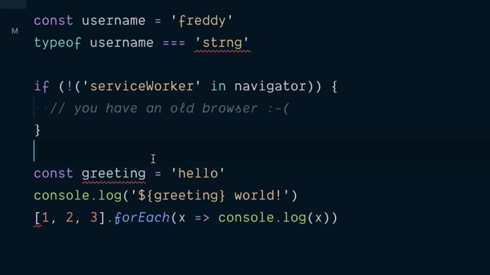

# Use Pre Built eslint Configuration.

Como se puede ver en la [documentación oficial de eslint](https://eslint.org/docs/rules/) el conjunto de reglas que tenemos a nuestra disposición para configurar es bastante amplio además de que es posible añadir muchas más reglas ya sea por nuestra parte o bien porque las instalamos de terceros.

Es por esto que puede parecer bastante recomendable el poder utilizar algún tipo de proceso por el que no tengamos que ir nosotros una a una estableciendo cuáles aplicar (junto con todas sus opciones) y cuáles no. En otras palabras, lo que pretendemos es que haya una especie de conjunto de reglas configuradas que se amolden a las características de nuestros proyectos y simplemente las podamos reutilizar todas las veces que nosotros queramos.

Afortunadamente los desarrolladores de eslint han pensado en esta posibilidad ofreciéndonos para ello el atributo `extends` dentro del objeto JSON que se utiliza para configurar la herramienta y que está recogido, recordemos, en el fichero `.eslintrc` en la raíz de nuestro proyecto. Este atributo va a tener que estar asignado a un valor que ha de ser un array donde cada uno de los elementos será un string que identicará el conjunto de reglas que se quieren seguir.

Así, si por ejemplo, queremos que nuestro proyecto siga el conjunto de reglas que están recomendadas por el equipo que ha desarrollador eslint escribiríamos algo como lo siguiente:

```json
{
  "parseOptions": {
    "ecmaVersion": 2019,
    "sourceType": "module",
    "ecmaFeatures": {
      "jsx": true
    }
  },
  "extends": [ "eslint:recommended" ],
  "rules": {
    "strict": ["error", "never"],
    "valid-typeof": "error",
    "no-unsafe-negation": "error",
    "no-unused-vars": "error",
    "no-unexpected-multiline": "error",
    "no-undef": "error"
  },
  "env": {
    "browser": true
  }
}
```

El identificador del conjunto de reglas recomendadas por eslint es `eslint:recommened` y gracias a ellas de todas las reglas que teníamos recogidas dentro del atributo `rules` simplemente vamos a tener que quedarnos con las referidas al uso de `strict` ya que el resto tienen los valores especificados en el objeto que teníamos hasta ahora lo que simplicará enormemente la configuración:

```json
{
  "parseOptions": {
    "ecmaVersion": 2019,
    "sourceType": "module",
    "ecmaFeatures": {
      "jsx": true
    }
  },
  "extends": [ "eslint:recommended" ],
  "rules": {
    "strict": ["error", "never"]
  },
  "env": {
    "browser": true
  }
}
```

---
**Nota:** realmente lo que estamos haciendo al dejar el atributo `rules` con el valor que hemos visto en el objeto JSON para la configuración de nuestra aplicación lo que estamos logrando es sobreescribir el valor que este atributo tiene en la configuración por defecto y que queremos que sea efectivo en nuestra aplicación.

En otras palabras el conjunto de reglas que nosotros especifiquemos en `rules` siempre prevalecerán sobre las que establezcamos en extends ya que se considera que tienen un ámbito local al proyecto (son más específicas) que las reglas sobre las que se están extendiendo.

---

Si queremos utilizar más de una configuración lo que tenemos que hacer es incluirlas como elementos adicionales en el array que se le asigna al atributo `extends` teniendo en cuenta que prevalecerá lo especificado en el último de los elementos sobre los anteriores. En otros palabras las opciones de configuración se mezclan entre todas ellas (merge) para obtener la configuración final que se aplicará en el proyecto.

Vamos ahora a volver a ejecutar eslint para que corrija automáticamente todas aquellos errores que pueda solucionar sin nuestra intervención para ver cómo nos queda el fichero con el que seguiremos trabajando:

<div style='text-align: center'>
  
</div>
<br />

lo que nos deja el contenido del fichero `example.js` como sigue:

```js
const username = 'freddy'
typeof username === 'strng'

if (!('serviceWorker' in navigator)) {
  // you have an old browser :-(
}

const greeting = 'hoello'
console.log('${ greeting } world')
[1, 2, 3].forEach(x => console.log(x))
```

lo que no impide que siga habiendo errores de análisis de código estático como así nos lo denota VSCode al mostrarnos partes de nuestro código subrayadas en color rojo:

<div style='text-align: center'>
  
</div>
<br />

El siguiente paso consistirá en corregir nosotros mismos aquellos errores que eslint ha podido solucionar. El primero de ellos lo encontramos en el la instrucción:

```js
typeof username === 'strng'
```

y el problema viene derivado de que `strng` no es un valor posible contra el que puede resolver el operador `typeof` de JavaScript por lo que parece que nos hemos equivocado al escribir el tipo. La corrección es tan sencilla como escribir que el tipo de datos contra el que vamos a chequear es un string:

```js
typeof username === 'string'
```

El segundo de los errors que aparece en realidad hace referencia a que estamos declarando la variable `greeting` pero no la estamos utilizando en ninguna parte del código:

```js
const greeting = 'hoello'
console.log('${ greeting } world')
```

El problema aquí viene derivado del hecho que nuestra intención es utilizar esta variable como parte de la template string que está recogida dentro del mensaje que queremos escribir por la consola pero en vez de utilizar el caracter \` para delimitar la template string hemos usado la comilla simple `'` y por lo tanto en el código nunca se está utilizando la constante `greeting`. Cambiando este caracter por el apropiado solventamos el error:
```js
const greeting = 'hoello'
console.log(`${ greeting } world`)
```

El último de los errores está marcado al inicio de la instrucción en la que estamos recorriendo un array de números:

```js
[1, 2, 3].forEach(x => console.log(x))
```

siendo lo que se conoce como el problema que se conoce como [multiline expression](https://eslint.org/docs/rules/no-unexpected-multiline) que básicamente lo que viene a hacer es asegurarnos que una expresión no parezca que forma parte de la anterior cuando puede razones por las que nos pueda llevar a confusión. La forma más sencilla para corregirlo consiste en añadir un `;` al inicio de la línea asegurando de esta manera que la instrucción anterior no continúa en la línea actual. Por lo tanto escribiremos:

```js
;[1, 2, 3].forEach(x => console.log(x))
```

Por lo tanto el código final tras haber hecho uso de eslint para evitar todas als reglas derivadas del análisis del código estático es el que se muestra a continuación:

```js
const username = 'freddy'
typeof username === 'string'

if (!('serviceWorker' in navigator)) {
  // you have an old browser :-(
}

const greeting = 'hoello'
console.log(`${ greeting } world`)
;[1, 2, 3].forEach(x => console.log(x))
```

<br />

----
<div>
  <div style="float: left">
    <a href="./02_03.md">
      < Use the eslint Extension for VSCode
    </a>
  </div>
  <div style="float: right">
    <a href="./02_05.md">
      Run eslint with npm Scripts >
    </a>
  </div>
</div>
