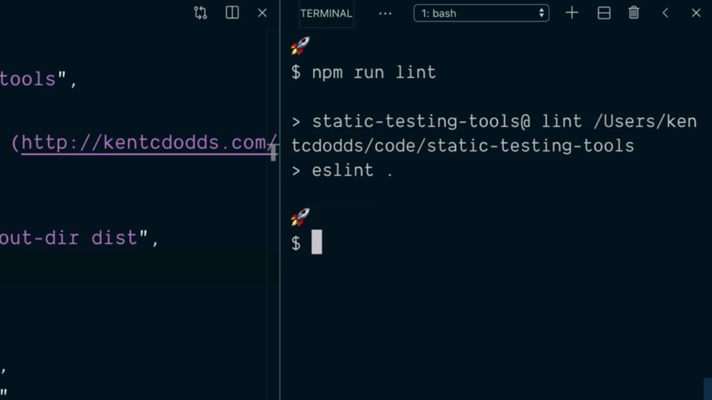
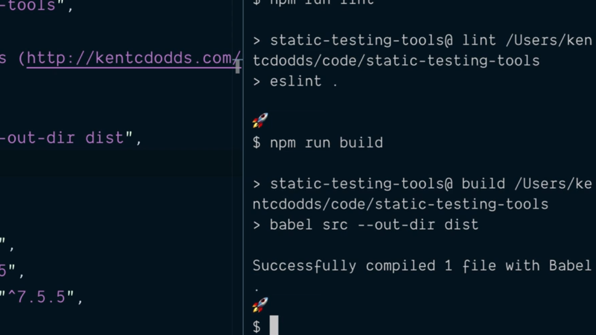
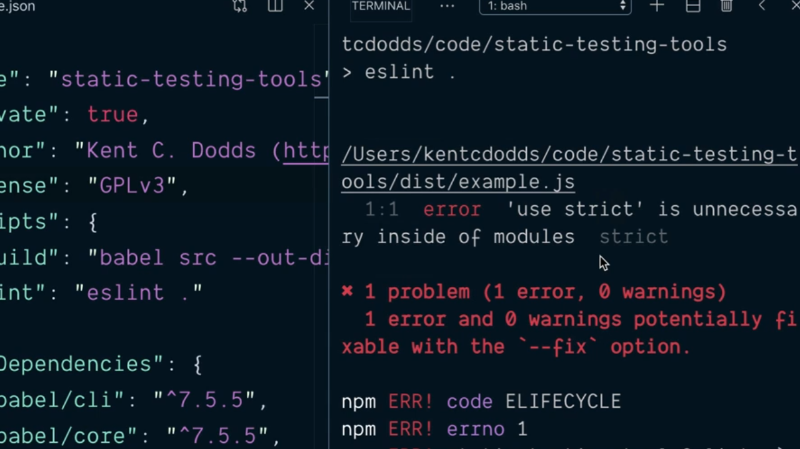
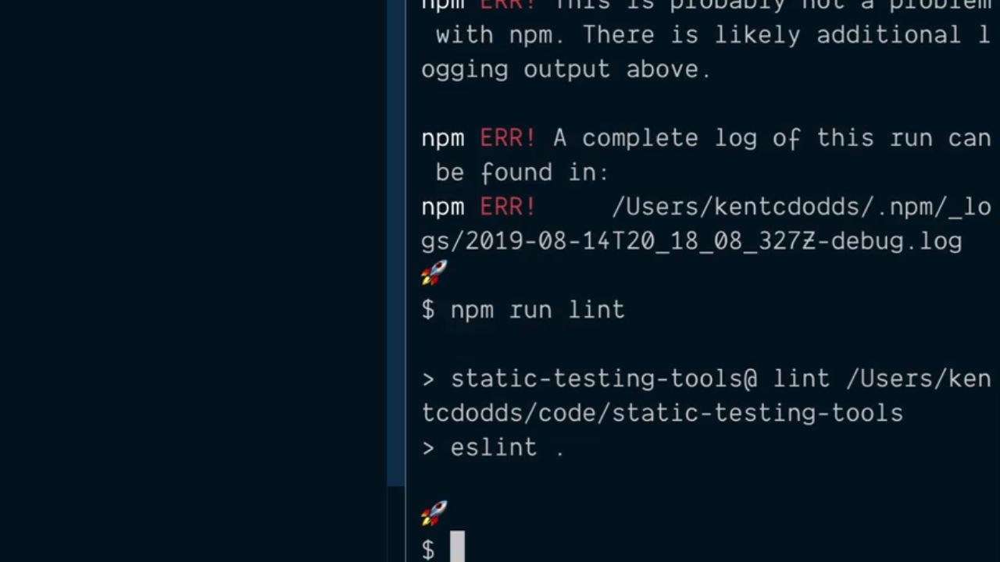
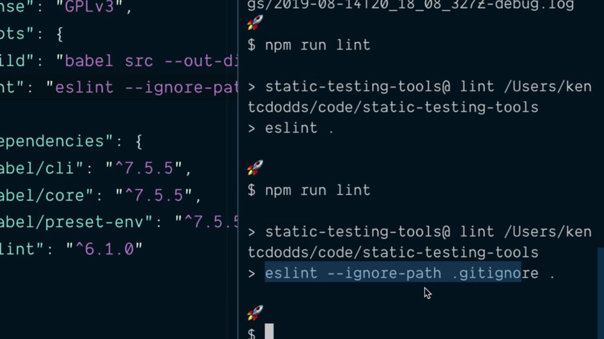

# Run eslint with npm Scripts.

El siguiente paso que tendremos que seguir para asegurar la calidad de nuestro código será añadir eslint como parte del proceso de creación del entregable que está asociado a nuestra aplicación por lo que lo que deberíamos añadir un script que se encargase de pasarlo como parte de los scripts que están recogidos en el fichero `package.json` del proyecto:

```json
{
  "name": "static-testing-tools",
  "private": true,
  "author": "Kent C. Dodds (http://kentcdodds.com/)",
  "license": "GPLv3",
  "scripts": {
    "build": "babel src --out-dir dist"
  },
  "devDependencies": {
    "@babel/cli": "^7.5.5",
    "@babel/core": "^7.5.5",
    "@babel/preset-env": "^7.5.5",
    "eslint": "^6.1.0",
    "prettier": "^1.18.2"
  }
}
```

Así pues editamos el fichero `package.json` añadiéndo un nuevo script que lo único que va a hacer es ejecutar eslint sobre todos los ficheros que forman parte de nuestro proyecto. Por ello escribimos lo siguiente:

```json
"scripts": {
  "build": "babel src --out-dir dist",
  "lint": "eslint ."
}
```

Para comprobar que todo está correcto simplemente ejecutamos el script `lint` que hemos definido de la siguiente manera desde la terminal del sistema:

<div style='text-align: center'>
  
</div>
<br />

El problema con el que nos encontramos con esta aproximación es que si ahora ejecutamos el script `build` que también está disponible dentro del fichero `package.json` con el fin de construir el entregable no se va a ejecutar eslint y por lo tanto no se va a realizar el análisis del código estático de nuestro proyecto.

<div style='text-align: center'>
  
</div>
<br />

Aquí lo que tenemos que entender es que Babel lo que habrá hechos erá transpilar el código de nuestra aplicación con las opciones que hayamos especificado depositándolo en el fichero `example.js` dentro del directorio `dist` de nuestro proyecto como tenemos configurado en el archivo `package.json. Pero ¿qué sucede su ahora desde la terminal de nuestro sistema volvemos a ejecutar eslint?

<div style='text-align: center'>
  
</div>
<br />

Vemos que aparece un error de análisis de código estático en el fichero `explample.js` correspondiente al código transpilado por Babel derivado de que esta herramienta añade la sentencia `use strict` al inicio de cada uno de los ficheros que estamos generando.

Normalmente no deberíamos tenernos que preocupar por el código que es transpilado porque lo que se pretende con el mismo es que sea compatible por la mayoría de los navegadores por lo que de alguna manera le tendremos que indicar a eslint que no queremos que realice el análisis del código que se encuentre dentro del fichero con los archivos ya transpilados. ¿Cómo se puede hacer esto?

Los creadores de eslint se basaron para ello en git y por eso vamos a crear un fichero denominado `.eslintignore` (análogo a `gitignore`) donde podemos indicar una lista de directorios y archivos que no queremos que sean tenidos en cuenta para el análisis del código estático. En nuestro caso escribiremos:

```js
node_modules
dist
```

Hecho esto tenemos la garantía de que cuando nuevamente volvamos a ejecutar eslint desde la terminal del sistema no se tendrá en cuenta para nada el código que pueda haber ni tanto el directorio `node_modules` (ni sus subdirectorios) ni en el directorio `dist` ni sus subdirectorios.

<div style='text-align: center'>
  
</div>
<br />

---
**Nota:** Teniendo en cuenta que una de las opciones más comunes en lo que respecta a cuáles son los archivos que han de ser ignorados por eslint es que sean los mismos que han de ser ignorados por git los desarrolladores de eslint nos ofrecen las posibilidad de invocar a eslint utilizando el flag `--ignore-path` cuyo valor a de ser el archivo que contiene los archivos y directorios a ignorar por la herramienta. Así, para hacer que sean los mismos que están recogidos en `.gitignore` escribiríamos algo como lo siguiente:

```json
"scripts": {
  "build": "babel src --out-dir dist",
  "lint": "eslint --ignore-path .gitignore ."
}
```

Si tras esto ejecutamos de nuevo eslint veremos como está aplicando esta nueva opción de configuración lo que nos va a permitir eliminar el fichero `.eslintignore` además de asegurarnos que cualquier cambio que se haga en el fichero `.gitignore` también afectará a eslint.

<div style='text-align: center'>
  
</div>
<br />

---

A continuación mostramos el contenido final del fichero `package.json` de nuestro proyecto para que tenga en cuenta los cambios que hemos hecho en este punto:

```json
{
  "name": "static-testing-tools",
  "private": true,
  "author": "Kent C. Dodds (http://kentcdodds.com/)",
  "license": "GPLv3",
  "scripts": {
    "build": "babel src --out-dir dist",
    "lint": "eslint --ignore-path .gitignore ."
  },
  "devDependencies": {
    "@babel/cli": "^7.5.5",
    "@babel/core": "^7.5.5",
    "@babel/preset-env": "^7.5.5",
    "eslint": "^6.1.0",
    "prettier": "^1.18.2"
  }
}
```
<br />

----
<div>
  <div style="float: left">
    <a href="https://github.com/DevJoseManuel/js-tutorials/blob/master/testing/ch01/02_02.md">
      < Use Pre Built eslint Configuration
    </a>
  </div>
  <div style="float: right">
    <a href="https://github.com/DevJoseManuel/js-tutorials/blob/master/testing/ch02/02_04.md">
      Format Code by Installing and Running Prettier >
    </a>
  </div>
</div>
