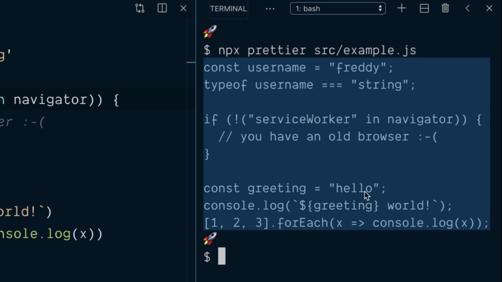
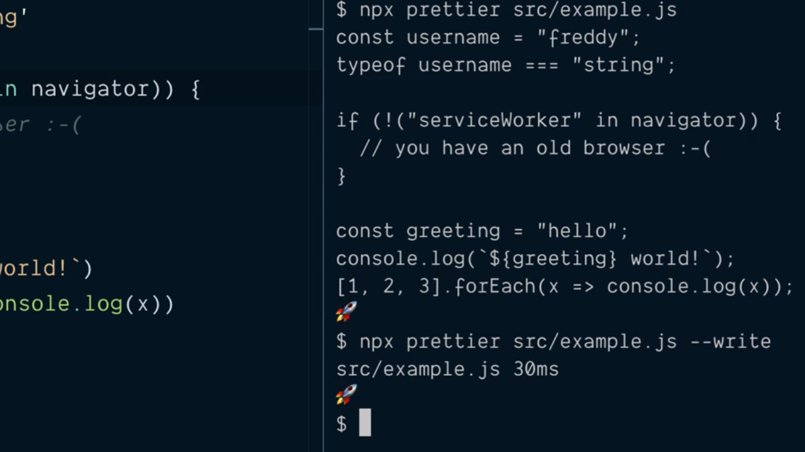
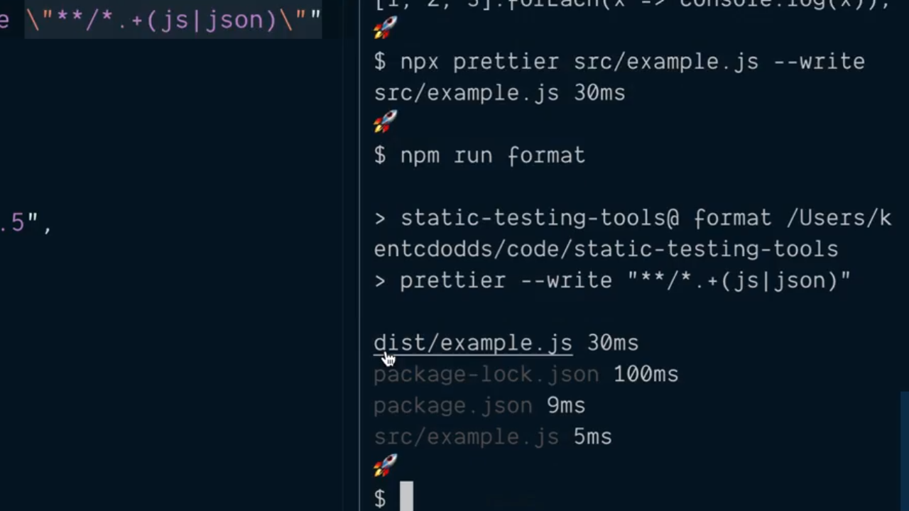
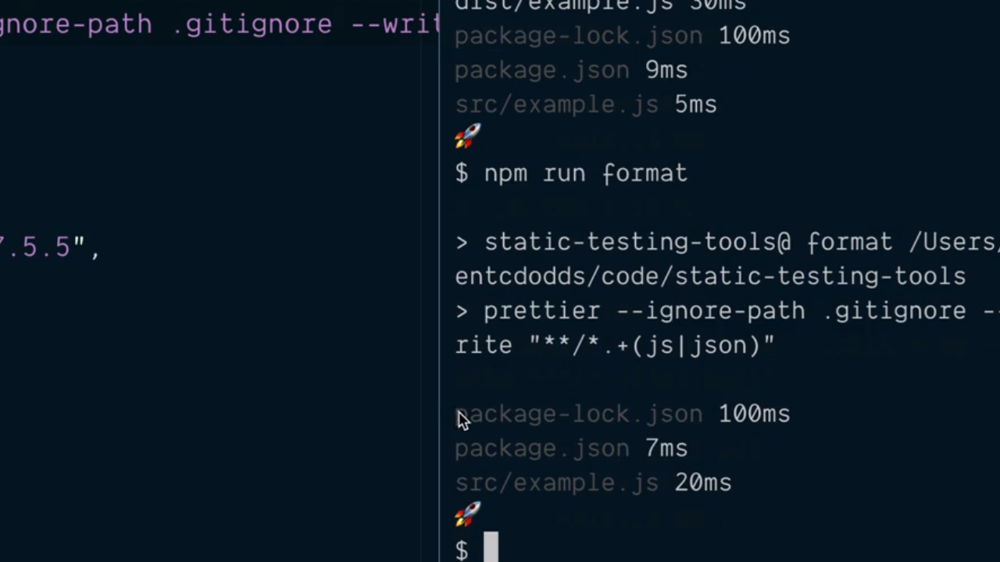

# Format Code by Installing and Running Prettier.

Uno de los aspectos que nos pueden llevar a distraer durante el proceso de desarrollo de nuestro código es decidir cómo vamos a formatearlo por lo que vamos a mostrar una herramienta que nos ayudará a ello y que hará que nuestro código se vea bien y de una forma consistente a lo largo de todos nuestros archivos.

La herramienta en cuestión se denomina [Prettier](https://prettier.io/) y como cualquier otra herramienta que estemos utilizando durante nuestro proceso de desarrollo lo primero que tendremos que hacer es instalarla como una dependencia de desarrollo gracias a npm:

```console
$ npm install --save-dev prettier
  + prettier@1.18.2
  [...]
```

Tras finalizar la instalación si nos dirigimos al fichero `package.json` veremos que se nos ha añadido una nueva dependencia que recoge la herramienta:

```json
{
  "name": "static-testing-tools",
  "private": true,
  "author": "Kent C. Dodds (http://kentcdodds.com/)",
  "license": "GPLv3",
  "scripts": {
    "build": "babel src --out-dir dist",
    "lint": "eslint --ignore-path .gitignore ."
  },
  "devDependencies": {
    "@babel/cli": "^7.5.5",
    "@babel/core": "^7.5.5",
    "@babel/preset-env": "^7.5.5",
    "eslint": "^6.1.0",
    "prettier": "^1.18.2"
  }
}
```

---
**Nota:** nuevamente podemos comprobar que tenemos a nuestra disposición el CLI de Prettier sin más que ir al directorio `.bin` dentro del directorio `node_modules` de nuestro proyecto y comprobar que dentro del mismo está el archivo `pettier`

---

Vamos a ver ahora cómo lo podemos utilzar para lo cual simplemente ejecutamos su CLI desde la línea de comandos pasándole como parámetro el fichero con el que se quiere trabajar:

```console
$ npx prettier src/example.js
```

Como resultado del mismo lo que vamos a ver es que Prettier nos muestra el mismo contenido del fichero del fichero sobre el que se está trabajando

<div style='text-align: center'>
  
</div>
<br />

Esto lo que quiere decir es que Prettier por defecto saca el resultado del formateo del código por la consola por lo que si queremos que el fichero original sea sobreescrito lo que tenemos que hacer es invocarlo con el flag `--write` como se puede ver a continuación:

```console
$ npx prettier src/example.js --write
```

En la salida por la consola obtenemos lo siguiente lo que nos garantizará que cuando lo apliquemos sobre los diferentes ficheros de nuestra aplicación el formato del código será consistente entre todos ellos:

<div style='text-align: center'>
  
</div>
<br />

El siguiente paso que vamos a realizar será crear un script npm que nos permita pasar Pettrier a todo los ficheros de nuestro proyecto de tal manera que así todos ellos tendrán el mismo formato. Dentro del fichero `package.json` creamos un nuevo script de la siguiente manera:

```json
"scripts": {
  "build": "babel src --out-dir dist",
  "lint": "eslint --ignore-path .gitignore .",
  "format": "prettier --write \"**/*.js\""
},
```

Con el comodín `**/*.js` lo que estamos indicando es que queremos que se apliquen todas las opciones de formateo del código a todos los archivos con la extensión `.js` que se encuentren en cualquier directorio del proyecto. Es más, como Prettier precisa que en el caso de estar utilizando un comodín la información ha de ir encerrada entre comillas dobles `"` es por lo que nos encontramos con que hemos tenido que escapar este caracter dentro del script.

Es más como actualmente Prettier puede trabajar con ficheros JSON vamos a indicar en nuestro script que cuando aplique que se sea también sobre este tipo de ficheros por lo que lo modificamos para o bien el archivo tenga la extensión `.js` o bien tenga la extensión `.json`:

```json
"scripts": {
  "build": "babel src --out-dir dist",
  "lint": "eslint --ignore-path .gitignore .",
  "format": "prettier --write \"**/*.+(js|json)\""
},
```

---
**Nota:** Prettier soporta además otros tipos de ficheros como son los archivos de hojas de estilo (que tendrán las extensión `.css`) o los ficheros XML (con las extensión `.xml`) por lo que simplemente tendremos que añadir la extensión de los mismos a la lista de formatos con los que queremos que trabaje.

---

Si ahora grabamos la modificación del fichero `package.json` y ejecutamos el nuevo script desde la terminal del sistema mediante la invocación de npm:

```console
$ npm run format
```

la salida que vamos a obtener será muy parecida a lo que podemos ver en la siguiente imagen:

<div style='text-align: center'>
  
</div>
<br />

donde vemos que todos los archivos que están recogidos dentro del proyecto que poseen la extensión `.json` o `.js` habrán sido formateados utilizando Prettier. En concreto la lista de ficheros que se nos muestra aparecen ficheros en color blanco y otros en color gris indicando con el primero de ellos que dicho fichero sí que ha sido formateado mientras que con el segundo color Prettier nos informará de que no se ha realizado ningún cambio.

Al igual que sucede con eslint los desarrolladores del Prettier nos ofrecen la posibilidad de indicar mediante un fichero qué ficheros y directorios queremos que sean ignorados del proceso del formateo y no solamente eso, sino que nos ofrece la posibilidad de utilizar el flag de invocación `--ignore-path` para indicar la ruta al archivo que contiene la definición de los archivos que se han de ignorar.

Siguiendo con la misma filosofía que en el caso de los ficheros que ha de ignorar eslint vamos a indicar que Prettier ignore todo el contenido que está recogido en el fichero `.gitignore`:

```json
"scripts": {
  "build": "babel src --out-dir dist",
  "lint": "eslint --ignore-path .gitignore .",
  "format": "prettier --ignore-path .gitignore --write \"**/*.+(js|json)\""
},
```

Guardamos esta modificación y volvemos a ejecutar el script `format` vermos que los únicos ficheros afectados (y en este caso modificados porque no le ha hecho falta) son los que no están recogidos como a ignorar en `.gitignore`:

<div style='text-align: center'>
  
</div>
<br />

A modo de resumen mostramos el contenido del fichero `package.json` tal y como está en este momento del desarrollo de nuestro proyecto:

```json
{
  "name": "static-testing-tools",
  "private": true,
  "author": "Kent C. Dodds (http://kentcdodds.com/)",
  "license": "GPLv3",
  "scripts": {
    "build": "babel src --out-dir dist",
    "lint": "eslint --ignore-path .gitignore .",
    "format": "prettier --ignore-path .gitignore --write \"**/*.+(js|json)\""
  },
  "devDependencies": {
    "@babel/cli": "^7.5.5",
    "@babel/core": "^7.5.5",
    "@babel/preset-env": "^7.5.5",
    "eslint": "^6.1.0",
    "prettier": "^1.18.2"
  }
}
```

<br />

----
<div>
  <div style="float: left">
    <a href="./02_05.md">
      < Run eslint with npm Scripts
    </a>
  </div>
  <div style="float: right">
    <a href="./02_07.md">
      Learn Configure Prettier >
    </a>
  </div>
</div>
