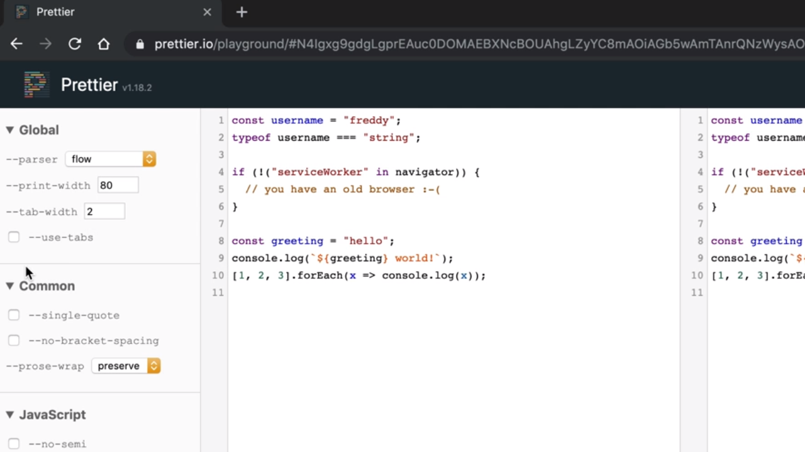
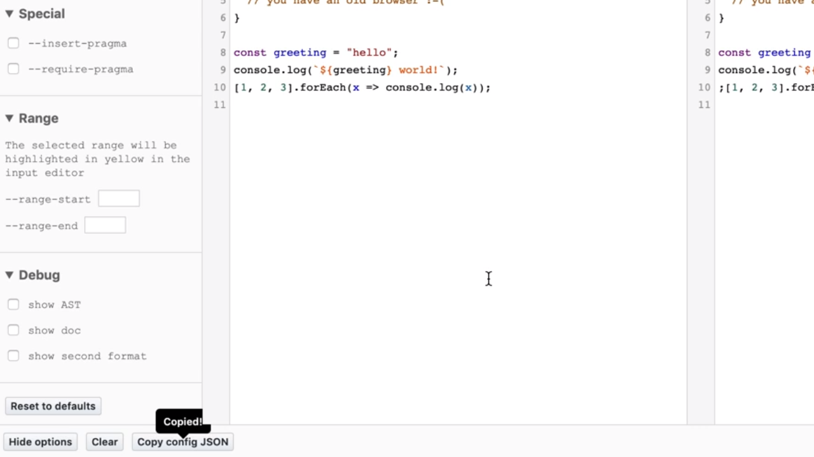
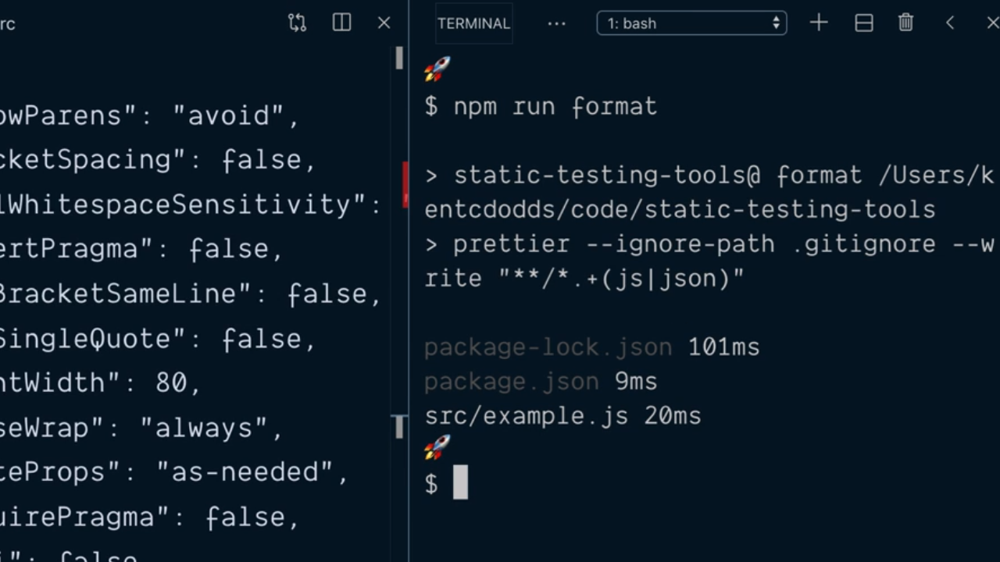

# Learn Configure Prettier.

El proyecto Prettier dispone en la actualidad de un [playground](https://prettier.io/playground/) al cual podemos acceder para ver cómo va a quedar nuestro código formateado. En este punto lo que vamos a hacer es copiar el código del archivo que estamos desarrollando y ver qué opciones de configuración tenemos que aplicar para obtener el resultado que deseamos.

<div style='text-align: center'>
  
</div>
<br />

En la parte de la izquierda el playground nos ofrece todas las opciones de configuración que podemos aplicar en nuestro proyecto dejándonos establecer los valores que queramos para conseguir el resultado que queramos. La idea final es que una vez demos con las que más nos gustan pulsemos sobre le botón *Copy config JSON* de tal manera que en el portapapeles tendremos un objeto JSON que recoge todas nuestras opciones:

<div style='text-align: center'>
  
</div>
<br />

Con esta información lo siguiente que tenemos que hacer es dentro de nuestro proyecto crear el fichero de configuración para Prettier que ha de tener el nombre `.prettierrc` y simplemente copiar el contenido del portapapeles. A modo de ejemplo mostramos el cóntenido del archivo que utilizaremos nosotros a lo largo del manual:

```json
{
  "arrowParens": "always",
  "bracketSpacing": false,
  "htmlWhitespaceSensitivity": "css",
  "insertPragma": false,
  "jsxBracketSameLine": false,
  "jsxSingleQuote": true,
  "printWidth": 80,
  "proseWrap": "always",
  "quoteProps": "as-needed",
  "requirePragma": false,
  "semi": false,
  "singleQuote": true,
  "tabWidth": 2,
  "trailingComma": "all",
  "useTabs": false
}
```

Con esta información si ahora ejecutamos desde la terminal del sistema de nuevo el script npm para formatear nuestro código veremos que estas opciones se aplicarán a todos los archivos que han de ser considerados (en nuestro ejemplo los ficheros con las extensiones `.js` o `.json`) dejándonos lo siguiente:

<div style='text-align: center'>
  
</div>
<br />

Es decir, que tras aplicar nuestras opciones de formateo el fichero `example.js` habrá quedado correctamente formateado.

<br />

----
<div>
  <div style="float: left">
    <a href="https://github.com/DevJoseManuel/js-tutorials/blob/master/testing/ch01/02_06.md">
      < Format Code by Installing and Running Prettier
    </a>
  </div>
  <div style="float: right">
    <a href="https://github.com/DevJoseManuel/js-tutorials/blob/master/testing/ch02/02_08.md">
      Use the Prettier Extension for VSCode >
    </a>
  </div>
</div>
