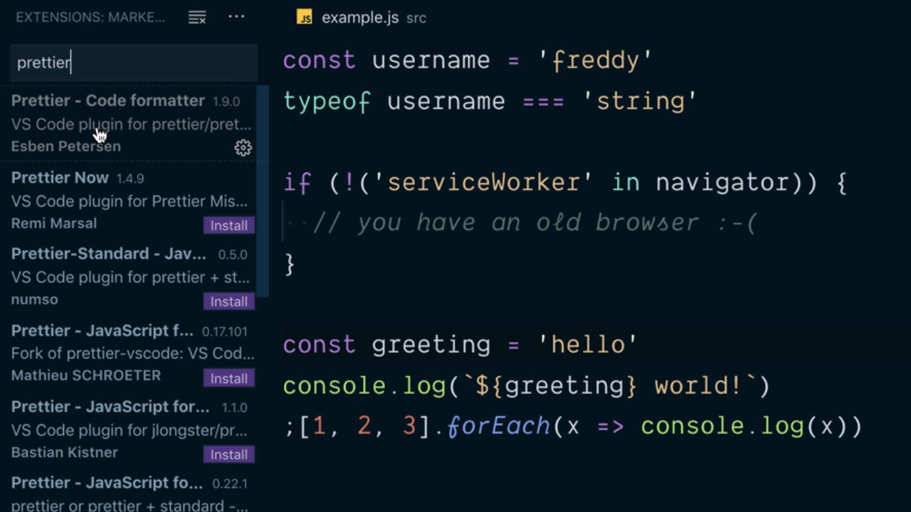
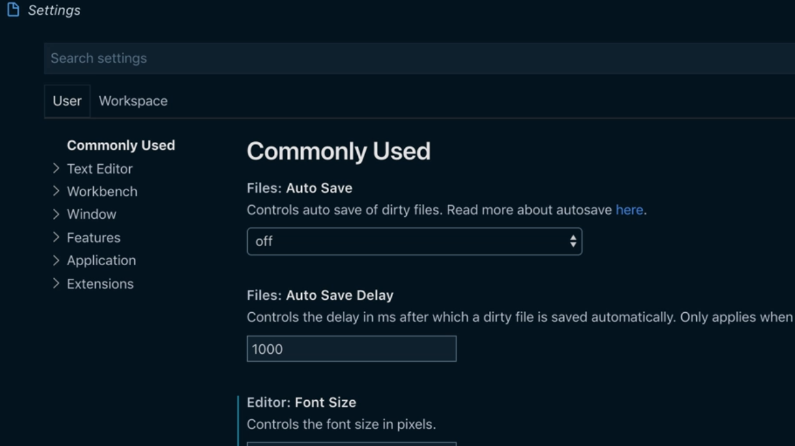
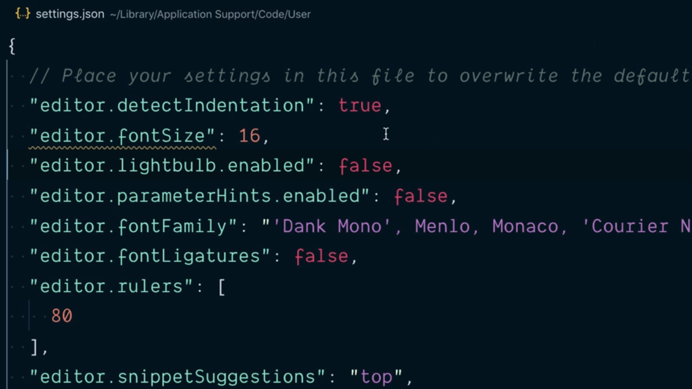
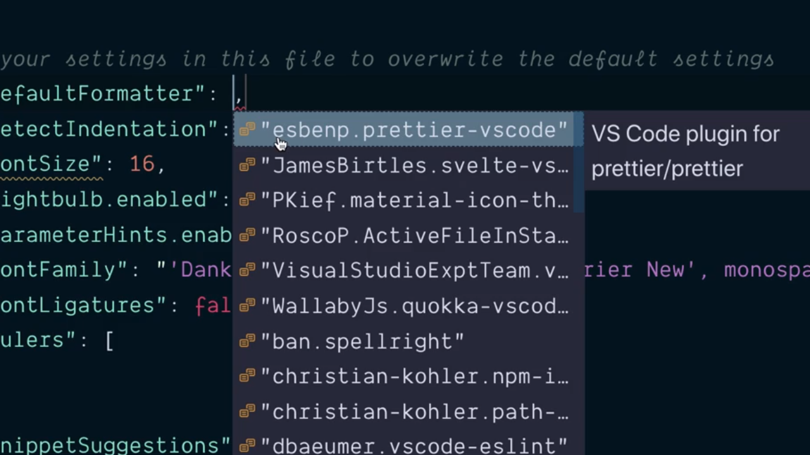

# Use the Prettier Extension for VSCode.

Actualmente VSCode tiene a nuestra disposición una extensión que nos va a permitir trabajar perfectamente con Prettier haciendo que los cambios en el formato del código sean visibles dentro del editor. Para instalarlo simplemente tenemos que ir a la pestaña de gestión de las extesiones y buscarlo:

<div style='text-align: center'>
  
</div>
<br />

Una vez lo tenemos instalado y activado (enabled) para poderlo utilizar todavía tenemos que aplicar alguna opción de configuración más dentro del editor. Para ello lo que vamos a hacer es ir a la pestaña de settings:

<div style='text-align: center'>
  
</div>
<br />

Y dentro de la misma elegiremos la vista como objeto JSON sin más que pulsar en el icono que representa a una página con una flecha simulando el volveo del papel que está situado en la parte superior derecha de la vista:

<div style='text-align: center'>
  
</div>
<br />

Tenemos que entender que para VSCode cada una de las opciones de configuración que tenemos a nuestra disposición pueden ser configuradas mendiante un atributo de este objeto JSON. Así, el primero de los elementos que vamos a utilizar se denomina `editor.defaultFormatter` el cual sirve para identificar cuál es el formateador de código que se utilizará por defecto. Al escribirlo vemos cómo VSCode nos ofrece una lista con todas las opciones entre las que podemos elegir:

<div style='text-align: center'>
  
</div>
<br />

Elegiremos `esbenp.prettier-vscode` ya que, como se puede ver en el tool-tip que se nos abre, se trata del formateador de código que estará asociado a Prettier.

El siguiente atributo que vamos a aplicar es `editor.formatOnSave` estableciéndolo al valor `true` de tal manera que así indicaremos a VSCode que cada vez que guardemos nuestro código queremos que lo formatee. 

---
**Nota:** siempre tenemos la posibilidad de fortear el código por nosotros dentro del propio editor sin tener previamente que guardarlo sin más que abrir el menú de comando (al cual se puede acceder, en el caso de los sistemas operativos macOS, con la combinación de las teclas `cmd + p`) y dentro del mismo teclear la opción `format`.

---


A continuación mostramos el conjunto de atributos del objeto JSON con la configuración de VSCode que hemos estado modificando hasta este punto:

```JSON
{
  "editor.defaultFormatter": "esbenp.prettier-vscode",
  "editor.formatOnSave": true
  /** Resto de las opciones. */
}
```

<br />

----
<div>
  <div style="float: left">
    <a href="./02_07.md">
      < Learn Configure Prettier
    </a>
  </div>
  <div style="float: right">
    <a href="./02_08.md">
      Disable Unnecessary eslint Stylistic Rules >
    </a>
  </div>
</div>
