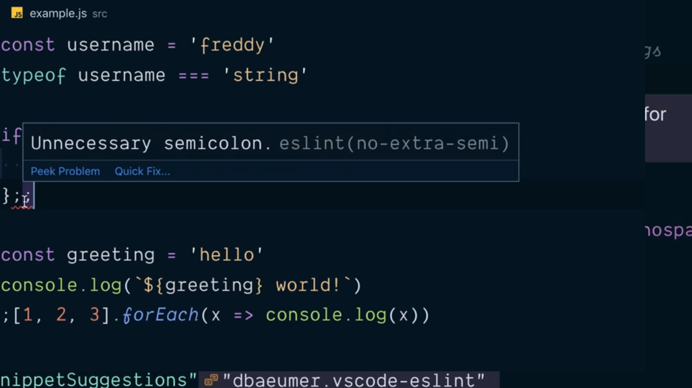

# Disable Unnecessary eslint Stylistic Rules.

En los puntos anteriores hemos estado viendo cómo funciona tanto eslint como Prettier para ayudarnos durante el proceso de desarrollo de nuestras aplicaciones. Sin embargo existen una situación que provocará que ambas herramientas colisionen y que tiene que ver con el hecho de tener una reglas de eslint que hará que no sea posible que alguna de las instrucciones de nuestro código pueda ser formateada como por ejemplo tener un doble `;` al final de una de las lineas de nuestro fichero, siendo esta una de las situaciones que Prettier puede solucionar ya que eliminará de forma automática todas aquellas que no sean necesarias:

<div style='text-align: center'>
  
</div>
<br />

Ante una situación como la anterior lo que podemos hacer es ver gracias al tool-tip que nos muestra VSCode asociado a la regla de eslint que se está violando (en el ejemplo anterior la regla `no-extra-semi`) y deshabilitarla de forma explícita en el fichero `.eslintrc`:

```json
{
  "parseOptions": {
    "ecmaVersion": 2019,
    "sourceType": "module",
    "ecmaFeatures": {
      "jsx": true
    }
  },
  "extends": [ "eslint:recommended" ],
  "rules": {
    "strict": ["error", "never"],
    "no-extra-semi": "off"
  },
  "env": {
    "browser": true
  }
}
```

Con esta modificación vamos a conseguir que pese a que escribamos más de dos caracteres `;` el final de las líneas eslint no nos va a dar ningún error:

<div style='text-align: center'>
  
</div>
<br />

Y no solamente esto sino que Prettier en el momento en el que guardemos nuesro código eliminará todo los caracteres `;` que no son necesarios.

Ahora bien, no parece una buena idea el seguir proceso de actuación por cada una de las reglas que entran en conflicto entre eslint y Prettier. Para ello que tenemos que hacer es instalar una nueva librería como una dependencia de desarrollo denominada `eslint-config-prettier`:

```console
$ npm install --save-dev eslint-config-prettier
  + eslint-config-prettier@^6.0.0
  [...]
```

Tras finalizar la instalación en el fichero `package.json` veremos que aparece una nueva dependencia de desarrollo:

```json
{
  "name": "static-testing-tools",
  "private": true,
  "author": "Kent C. Dodds (http://kentcdodds.com/)",
  "license": "GPLv3",
  "scripts": {
    "build": "babel src --out-dir dist",
    "lint": "eslint --ignore-path .gitignore .",
    "format": "prettier --ignore-path .gitignore --write \"**/*.+(js|json)\""
  },
  "devDependencies": {
    "@babel/cli": "^7.5.5",
    "@babel/core": "^7.5.5",
    "@babel/preset-env": "^7.5.5",
    "eslint": "^6.1.0",
    "eslint-config-prettier": "^6.0.0",
    "prettier": "^1.18.2"
  }
}
```

Para que ahora aplique esta librería dentro de eslint lo que tenemos que hacer es modificar el fichero `.eslintrc` haciendo que el array que está asociado al atributo `extends` que en la última posisición del mismo (lo que hace que sea la última regla de configuración que se va a aplicar) esté la librería que acabamos de instalar. Esto nos deja el contenido de este fichero de esta manera donde además de modificar este atributo tenemos que eliminar el atributo `no-extra-semi` del atributo `rules`:

```json
{
  "parseOptions": {
    "ecmaVersion": 2019,
    "sourceType": "module",
    "ecmaFeatures": {
      "jsx": true
    }
  },
  "extends": [ 
    "eslint:recommended",
    "eslint-config-prettier"
  ],
  "rules": {
    "strict": ["error", "never"]
  },
  "env": {
    "browser": true
  }
}
```

----
**Nota:** Es importante señalar que el proyecto [eslint-prettier-config](https://github.com/prettier/eslint-config-prettier) deshabilita otro conjunto de reglas dentro de eslint por lo que se recomienda leer la documentación oficial para saber cuáles son.

<br />

----
<div>
  <div style="float: left">
    <a href="https://github.com/DevJoseManuel/js-tutorials/blob/master/testing/ch01/02_06.md">
      < Use the Prettier Extension for VSCode
    </a>
  </div>
  <div style="float: right">
    <a href="https://github.com/DevJoseManuel/js-tutorials/blob/master/testing/ch02/02_09.md">
      Validate all Files Are Properly Formatted >
    </a>
  </div>
</div>
