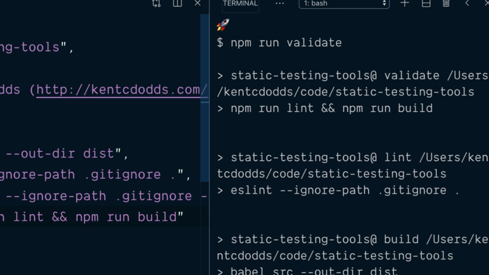
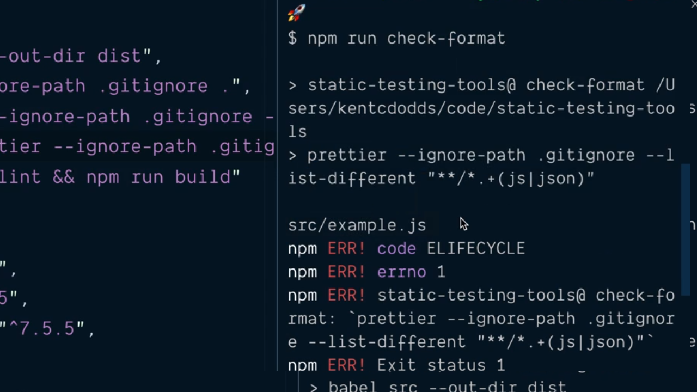
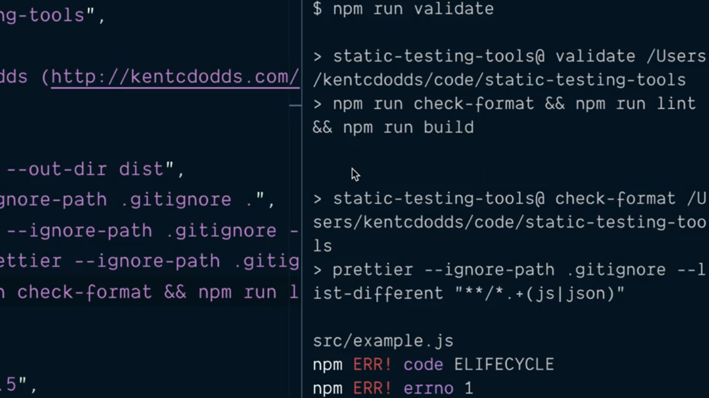
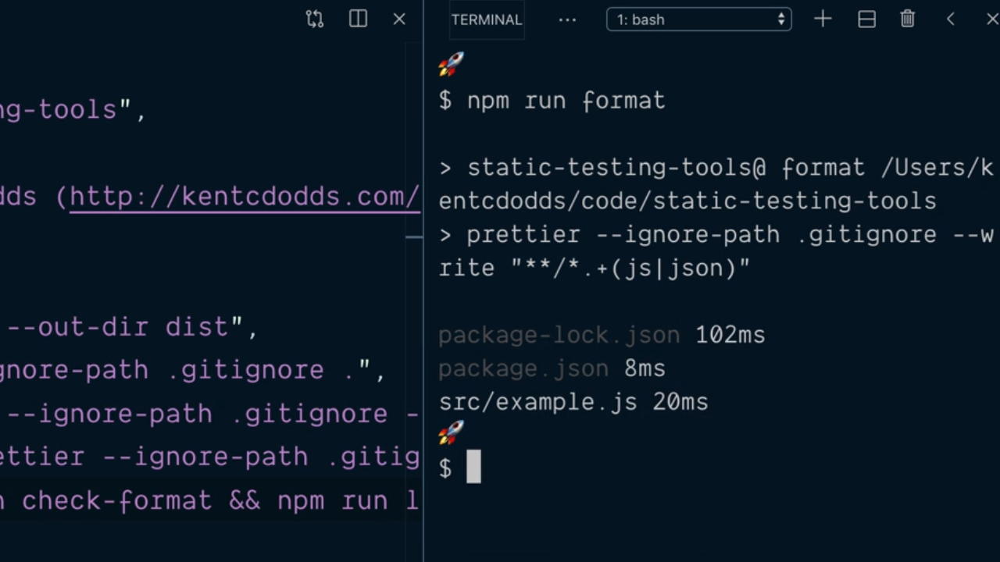
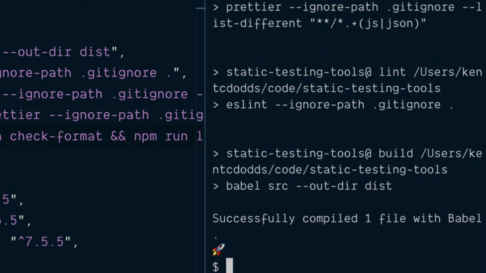

# Validate all Files Are Properly Formatted.

Uno de los aspectos que más nos pueden interesar cuando estamos desarrollando nuestras aplicaciones es tener la posibilidad de evaluar que nuestro proyecto se encuentra en un estado válido y para ello, dentro del fichero `package.json` vamos a crear un nuevo script de tal manera que cuando lo invoquemos realice este trabajo.

Lo primero que tenemos que pensar es en qué vamos a entender por validar el proyecto siendo esta la operación que hay que llevar a cabo consistente en primer lugar en realiazar el análisis del código estático (lint) y posteriormente realizar la construcción del entregable (built):

```json
"scripts": {
  "build": "babel src --out-dir dist",
  "lint": "eslint --ignore-path .gitignore .",
  "format": "prettier --ignore-path .gitignore --write \"**/*.+(js|json)\"",
  "validate": "npm run lint && npm run built"
},
```

Si ahora nos dirigimos a la terminal del sistema y ejecutamos el nuevo script veremos que efectivamente realizará los dos pasos:

<div style='text-align: center'>
  
</div>
<br />

También nos gustaría poder asegurar que todos los ficheros que forman parte de nuestro proyecto están correctamente formateados siguiendo las reglas que hayamos establecido en Prettier para lo cual vamos a crear un nuevo script dentro `package.json`:

```json
"scripts": {
  "build": "babel src --out-dir dist",
  "lint": "eslint --ignore-path .gitignore .",
  "format": "prettier --ignore-path .gitignore --write \"**/*.+(js|json)\"",
  "check-format": "prettier --ignore-path .gitignore --list-different \"**/*.+(js|json)\"",
  "validate": "npm run lint && npm run built"
},
```

Como se puede apreciar la diferencia que existe entre la invocación a prettier en el script `format` y en el script `check-format` tien que ver con la aplicación de los flags `--write` y `--list-different` respectivamente. Para comprobar cómo funciona vamos a modificar el formato de alguno de los ficheros que forman parte de nuestro proyecto (en nuestro caso desde fuera de VSCode para asegurarnos de que no se invoca a Prettier al grabarlo) y desde la terminal de comandos invocamos el script que acabamos de crear:

<div style='text-align: center'>
  
</div>
<br />

Vemos que Prettier nos informa de la existencia de un error en el formato del fichero `src/example.js` (el que hemos elegido para modificar) y por lo tanto finaliza su ejecución con un error. 

Parece pues interesante la ejecución del escript `check-format` como parte del proceso de validación del código de nuestro proyecto y, no solamente eso, sino que además parece que este chequeo ha de ser el primero que se realice dentro del proceso de validación por lo que añadimos la invocación a este nuevo script como el primer paso que se realizará en el script `validate`:

```json
"scripts": {
  "build": "babel src --out-dir dist",
  "lint": "eslint --ignore-path .gitignore .",
  "format": "prettier --ignore-path .gitignore --write \"**/*.+(js|json)\"",
  "check-format": "prettier --ignore-path .gitignore --list-different \"**/*.+(js|json)\"",
  "validate": "npm run validate && npm run lint && npm run built"
},
```

Así, cuando ahora ejecutemos el script `validate` para poder construir nuestro proyecto y se produzca un error de validación como consecuencia del error que lanza la ejecución del script `check-format` que se encargará de verificar el formato de nuestros ficheros estaremos ante una situación en la que se listará el error en la terminal:

<div style='text-align: center'>
  
</div>
<br />

Y lo que podremos hacer será invocar al script `format` para que Prettier aplique las modificaciones en el formateo de los archivos que forman parte de nuestro proyecto:

<div style='text-align: center'>
  
</div>
<br />

Hecho lo cual podremos volver a ejecutar el script `validate` con el fin e validar el formato, realizar el análisis del código estático y por último generar el código entregable:

<div style='text-align: center'>
  
</div>
<br />

Tras la finalización de este script lo que podemos asegurar es que nuestro proyecto se encuentra en un buen estado ya que ha pasado correctamente el script `validate`.

Aún así todavía podemos afinar un poco más la construcción del fichero `package.json` ya que, si nos fijamos bien, la única diferencia que existe entre la invocación de los scripts `format` y `check-format` es el uso del flag `--write` e `--list-diferent` respectivamente. Es por ello que vamos a sacar lo que es común a un nuevo script que denominaremos `prettier`:

```json
"scripts": {
  "build": "babel src --out-dir dist",
  "lint": "eslint --ignore-path .gitignore .",
  "prettier": "check-format": "prettier --ignore-path .gitignore \"**/*.+(js|json)\"",
  "format": "prettier --ignore-path .gitignore --write \"**/*.+(js|json)\"",
  "check-format": "prettier --ignore-path .gitignore --list-different \"**/*.+(js|json)\"",
  "validate": "npm run validate && npm run lint && npm run built"
},
```

Y lo siguiente que tendremos que hacer es modificar la invocación de los script `format` y `check-format` para que ambos invoquen a `prettier` vía npm pero pasándole el flag necesario en cada caso. Esto se logra mediante la utilización del flag `--` de npm (que indicará que queremos pasarle un flag al propio npm) y como valor del mismo el flag que queremos pasarle al script que vamos a invocar. Esto se entiende mucho mejor viendo cómo va a quedar el código:

```json
"scripts": {
  "build": "babel src --out-dir dist",
  "lint": "eslint --ignore-path .gitignore .",
  "prettier": "check-format": "prettier --ignore-path .gitignore \"**/*.+(js|json)\"",
  "format": "npm run prettier -- --write",
  "check-format": "npm run prettier -- --list-different",
  "validate": "npm run validate && npm run lint && npm run built"
},
```

Con esto lo que hemos logrado es agrupar todas aquellas partes que son comunes a la invocación de Prettier en el script `prettier` y las tareas específicas quedarán recogidas en los scripts más específicos `format` y `check-format`.

A continuación mostramos el contenido del fichero `package.json` con todas las modificaciones que hemos ido realizando hasta este punto:

```json
{
  "name": "static-testing-tools",
  "private": true,
  "author": "Kent C. Dodds (http://kentcdodds.com/)",
  "license": "GPLv3",
  "scripts": {
    "build": "babel src --out-dir dist",
    "lint": "eslint --ignore-path .gitignore .",
    "prettier": "check-format": "prettier --ignore-path .gitignore \"**/*.+(js|json)\"",
    "format": "npm run prettier -- --write",
    "check-format": "npm run prettier -- --list-different",
    "validate": "npm run validate && npm run lint && npm run built"
  },
  "devDependencies": {
    "@babel/cli": "^7.5.5",
    "@babel/core": "^7.5.5",
    "@babel/preset-env": "^7.5.5",
    "eslint": "^6.1.0",
    "eslint-config-prettier": "^6.0.0",
    "prettier": "^1.18.2"
  }
}
```

<br />

----
<div>
  <div style="float: left">
    <a href="https://github.com/DevJoseManuel/js-tutorials/blob/master/testing/ch01/02_09.md">
      < Disable Unnecessary eslint Stylistic Rules
    </a>
  </div>
  <div style="float: right">
    <a href="https://github.com/DevJoseManuel/js-tutorials/blob/master/testing/ch02/02_11.md">
      Avoid Common Errors by Installing and Configuring TypeScript >
    </a>
  </div>
</div>
