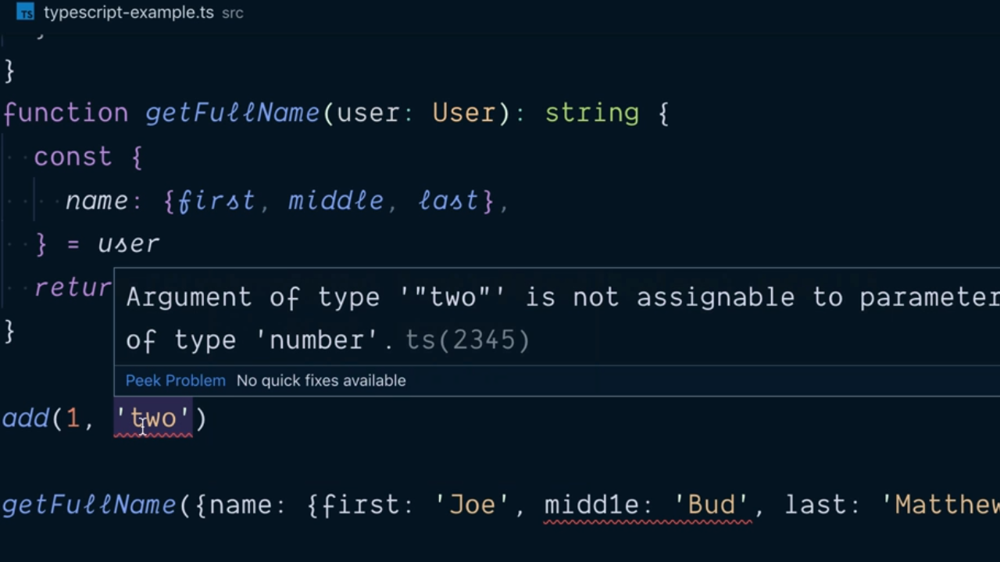
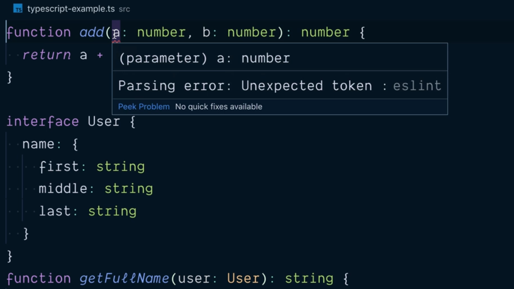
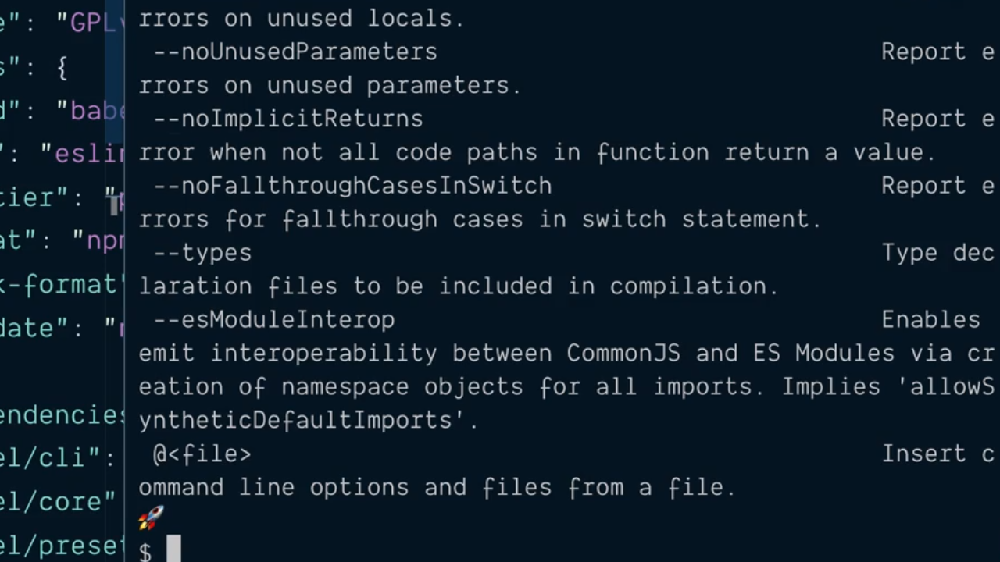
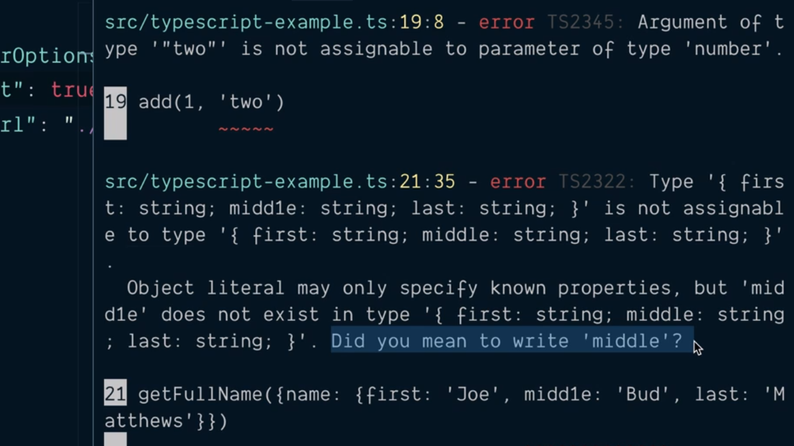
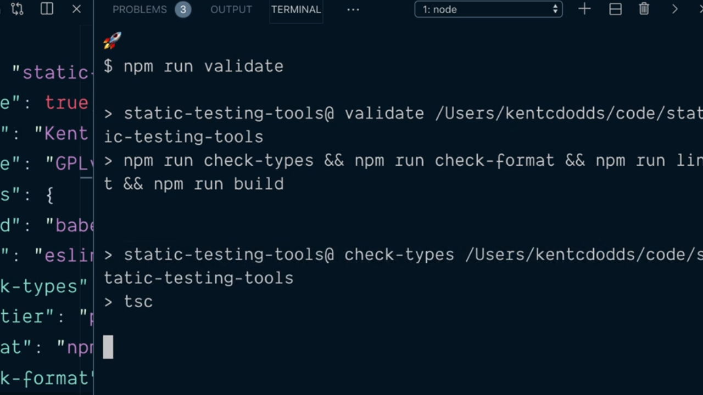
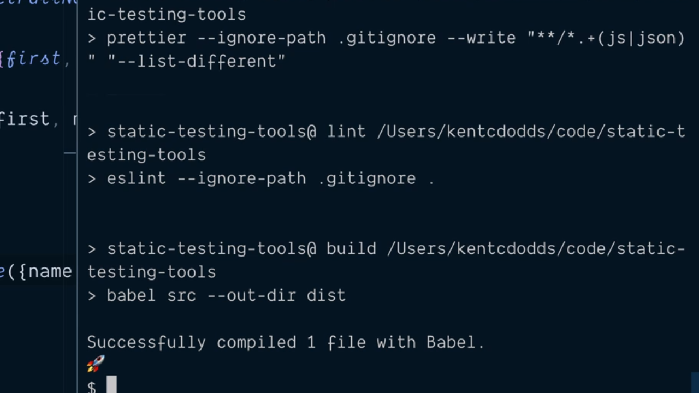
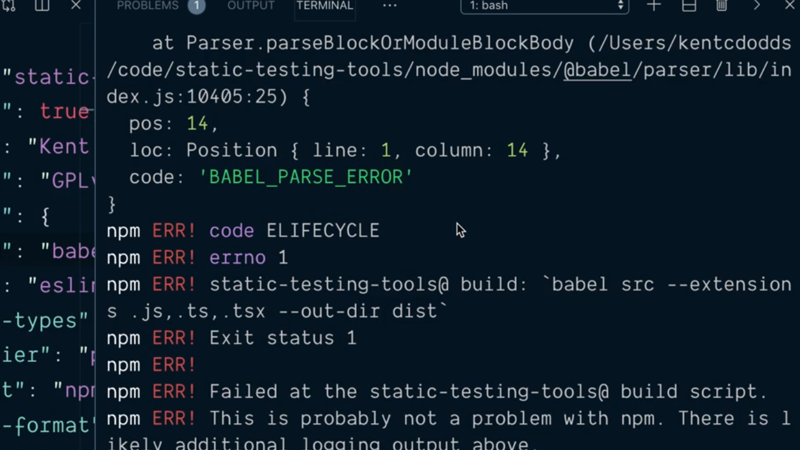
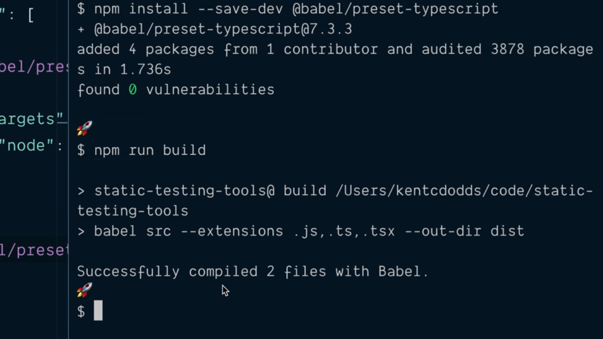

# Avoid Common Errors by Installing and Configuring TypeScript.

Vamos a echarle un vistazo al siguiente código para ver si de forma fácil podemos ver los dos pequeños errores que están contenidos dentro del mismo:

```js
function add(a, b) {
  return a + b
}

function getFullName(user) {
  const {
    name: { first, middle, last }
  } = user
  return [first, middle, last].filter(Boolean).join(' ')
}

add(1, 'two')
getFullName({ name: { first: 'Joe', midd1e: 'Bud', last: 'Mathews' }})
```

El primero de ellos es más o menos evidente ya que estamos haciendo la invocación de la función `add` que se supone que va a servir para realizar la suma de dos números pero en este caso le estamos pasando como parámetros el valor de un número `1` y el valor de un string `two` lo que provocará que el resultado de no sea un número sino el string `1two`.

El segundo error es algo más difícil de ver porque no es propiamente un error en la funcionalidad del código en sí misma sino que nos hemos equivocado escribiendo el valor del atributo `middle` en la invocación de la función `getFullName` ya que en vez de utilizar una `l` lo que hemos tecleado es un `1` siendo este un tipo de error que mientras estamos trabajando es mucho más complicado de detectar.

Para ayudarnos en la detección de este tipo de errores es donde entra en juego **[TypeScript](https://www.typescriptlang.org/)**. Lo primero que tenemos que hacer para poderlo utilizar es, como sucede con cualquier otra librería pasar a instalarlo como una dependencia de desarrollo por lo que desde la terminal del sistema escribiremos:

```console
$ npm install --save-dev typescript
  +typescript@3.5.3
  [...]
```

Si ahora vemos el contenido del fichero `package.json` podemos ver cómo entre las dependencias de desarrollo nos aparece la que se corresponde con TypeScript tal y como esperábamos:

```json
{
  "name": "static-testing-tools",
  "private": true,
  "author": "Kent C. Dodds (http://kentcdodds.com/)",
  "license": "GPLv3",
  "scripts": {
    "build": "babel src --out-dir dist",
    "lint": "eslint --ignore-path .gitignore .",
    "prettier": "check-format": "prettier --ignore-path .gitignore \"**/*.+(js|json)\"",
    "format": "npm run prettier -- --write",
    "check-format": "npm run prettier -- --list-different",
    "validate": "npm run check-format && npm run lint && npm run built"
  },
  "devDependencies": {
    "@babel/cli": "^7.5.5",
    "@babel/core": "^7.5.5",
    "@babel/preset-env": "^7.5.5",
    "eslint": "^6.1.0",
    "eslint-config-prettier": "^6.0.0",
    "prettier": "^1.18.2",
    "typescript": "^3.5.3"
  }
}
```

Una vez finaliza la instalación del mismo si nos vamos al directorio `.bin` dentro de `node_modules` vemos que aparece el fichero `tsc` (TypeScript Compiler) como el CLI que podemos ejecutar para poder ejecutar TypeScript desde la terminal de nuestro sistema.

El siguiente paso que vamos a realizar es crear una copia del fichero que contiene la definición del código anterior que contendrá todas las anotaciones de TypeScript que van a permitir realizar el análisis del código estático. Así pues, creamos un nuevo fichero con la extensión `.ts` (extensión qu está relacionada con TypeScript) e inicialmente dentro del mismo lo que hacemos es escribir el código JavaScript del que estamos partiendo con todas las anotaciones que van a permitir realizar esta validación:

```ts
function add(a: number, b: number) {
  return a + b
}

interface User {
  name: {
    first: string
    middle: string
    last: string
  }
}

function getFullName(user: User): string {
  const {
    name: { first, middle, last }
  } = user
  return [first, middle, last].filter(Boolean).join(' ')
}

add(1, 'two')
getFullName({ name: { first: 'Joe', midd1e: 'Bud', last: 'Mathews' }})
```

De tal manera que como estamos trabajando con VSCode y este editor tiene incorporado dentro de sí la posibilidad de trabajar con TypeScript veremos que, de forma similar a como hace eslint, aparecerán subrayados todas aquellas partes del código que presentan algún tipo de error en lo relativo a las verificaciones de TypeScript:

<div style='text-align: center'>
  
</div>
<br />

Y no solamente eso sino que, como podemos ver en la imagen anterior, si situamos el cursor en el punto del código en el que se muestra el error VSCode nos abrirá un tool-tip en el que podemos obtener una explicación más detallada de las causas que han provocado el error en cuestión.

Sin embargo, VSCode también nos está mostrando un error en el parámetro `a` de la función `add` dentro del código fichero TypeScript pero en este caso no se trata de un error de TypeScript sino que es un error derivado de eslint porque no entiende que un parámetro pueda ser definido seguido de los dos punto `:` ya que en JavaScript esto no es así.

<div style='text-align: center'>
  
</div>
<br />

Si desde la terminal del sistema ejecutamos la invocación del compilador de TypeScript mediante la invocación de `tsc` gracias a npx nos encontraremos con que aparecen una gran cantidad de errores. Así si ejecutamos:

```console
$ npx tsc
```

La salida que obtendremos por la consola del sistema tendrá una apariencia muy parecida a lo siguiente:

<div style='text-align: center'>
  
</div>
<br />

Todos estos errores vienen derivados de que no tenemos TypeScript correctamente configurado dentro de nuestro proyecto. Para realizar la configuración dentro de la raíz del proyecto en el que estamos trabajando crearemos el fichero `tsconfig.json` (fichero que se utiliza con el propósito de configurar todas las opciones para el compilador de TypeScript) el cual posee en su interior un objeto JSON en el que vamos a especificar las opciones de configuración con las que queremos trabajar.

---
**Nota:** Aunque son muchas las opciones de configuración que podemos establecer dentro de este fichero nosotros vamos a centrarnos en las más habituales denjando al lector que pueda estar interesado en profundizar más ellas que acuda a la [documentación oficial](https://www.typescriptlang.org/tsconfig).

---

Dentro del fichero `tsconfig.json` vamos a definir el atributo `compilerOptions` para establecer las opciones que queremos que apliquen al compilador de TypeScript el cual espera tener asignado un objeto como valor:

```json
{
  "compilerOptions": {
  }
}
```

Lo primero que le queremos indicar al compilador de TypeScript es el lugar en el que se encontrarán los ficheros que tiene que compilar y esto se logra estableciendo el valor del atributo `baseUrl` al que se le ha de indicar como valor el path en el que tiene que buscar los ficheros:

```json
{
  "compilerOptions": {
    "baseUrl": "./src"
  }
}
```

El siguiente paso que queremos indicar es que no vamos a querer que TypeScript sea el encargado de crear el archivo entregable de nuestro proyecto (opción que tiene por defecto) sino que lo que queremos que haga sea la verificación estática del tipo de datos con el que se está trabajando dejando que sea Babel el que se encargue de realizar el entregable del mismo. Con este fin tenemos que establer el valor del atributo `noEmit` a `true` dentro de las opciones para el compilador:

```json
{
  "compilerOptions": {
    "baseUrl": "./src",
    "noEmit": true
  }
}
```

Simplemente con estas dos opciones si ahora volvemos a ejecutar el compilador de TypeScript desde la línea de comandos:

```console
$ npx tsc
```

Por la propia consola nos informará de los errores que TypeScript puede detectar dentro del código fuente de nuestra aplicación como se estaba haciendo en VSCode:

<div style='text-align: center'>
  
</div>
<br />

Hecho esto y comprobado además que está funcionando tal y como queremos el siguiente paso que vamos a dar va a ser incluir un script dentro del fichero `package.json` del proyecto que se encargue de realizar la compilación de nuestros ficheros utilizando TypeScript al que vamos a llamar `check-types` y dentro del cual únicamente vamos a tener que llamar al compilador de TypeScript:

```json
"scripts": {
  "build": "babel src --out-dir dist",
  "lint": "eslint --ignore-path .gitignore .",
  "check-types": "tsc",
  "prettier": "check-format": "prettier --ignore-path .gitignore \"**/*.+(js|json)\"",
  "format": "npm run prettier -- --write",
  "check-format": "npm run prettier -- --list-different",
  "validate": "npm run check-format && npm run lint && npm run built"
},
```

Y el siguiente paso será añadir la invocación de este script en la ejecución de nuestro script `validate` para que el proceso de compilación de TypeScript se añada al proceso de validación del código de nuestro proyecto. Así pues escribiremos:

```json
"scripts": {
  "build": "babel src --out-dir dist",
  "lint": "eslint --ignore-path .gitignore .",
  "check-types": "tsc",
  "prettier": "check-format": "prettier --ignore-path .gitignore \"**/*.+(js|json)\"",
  "format": "npm run prettier -- --write",
  "check-format": "npm run prettier -- --list-different",
  "validate": "npm run check-types && npm run check-format && npm run lint && npm run built"
},
```

Si ahora desde la terminal del sistema realizamos la invocación del script `validate` podemos comprobar como el proceso de invocación del compilador de TypeScript es el primero que se llama como parte de la validación del código fuente de nuestro proyecto.

<div style='text-align: center'>
  
</div>
<br />

Si dentro del código fuente de nuestro proyecto corregimos los dos errores que tenemos en recogidos dentro del mismo:

```ts
add(1, 2)
getFullName({ name: { first: 'Joe', middle: 'Bud', last: 'Mathews' }})
```

y volvemos a invocar al script `validate` podemos comprobar como se realiará el proceso de validación con TypeScript, la verificación del formato del código con Prettier, el análisis del código estático con eslint y por último el proceso de construcción del entregable (transpilación) con Babel:

<div style='text-align: center'>
  
</div>
<br />

Sin embargo hay un par de cosas que todavía nos quedan por configurar correcmente en nuestro proceso de validación. La primera de ellas tiene que con la inscursión de TypeScript la extensión de los ficheros con los que está trabajando Prettier es `.js` y `.json` por lo que tenemos que añadir la extensión `.ts` (y `.tsx` en el caso de los fichero que contendrán código JSX pero en este caso codificados utilizando TypeScript) a la lista de extensión con las que ha de trabajar:

```json
"scripts": {
  "build": "babel src --out-dir dist",
  "lint": "eslint --ignore-path .gitignore .",
  "check-types": "tsc",
  "prettier": "check-format": "prettier --ignore-path .gitignore \"**/*.+(js|json|ts|tsx)\"",
  "format": "npm run prettier -- --write",
  "check-format": "npm run prettier -- --list-different",
  "validate": "npm run check-types && npm run check-format && npm run lint && npm run built"
},
```

Y el segundo de los problemas que es un poco más difícil de detectar tiene que ver con el hecho de que únicamente se ha compilado un fichero con Babel cuando en realidad dentro del proyecto que estamos desarrollando tenemos dos ficheros con el mismo código: uno con la extensión `.js` y otro con la extensión `.ts`. En este caso para lograr que Babel compile ambos ficheros tenemos que añadir el flag `--extensions` cuando se está invocando al script `build` ya que es el flag que espera recibido Babel recogiendo la extensiones (separadas por comas) de los ficheros que ha de transpilar. Por lo tanto escribiremos:

```json
"scripts": {
  "build": "babel src  --extensions .js,.ts,.tsx --out-dir dist",
  "lint": "eslint --ignore-path .gitignore .",
  "check-types": "tsc",
  "prettier": "check-format": "prettier --ignore-path .gitignore \"**/*.+(js|json|ts|tsx)\"",
  "format": "npm run prettier -- --write",
  "check-format": "npm run prettier -- --list-different",
  "validate": "npm run check-types && npm run check-format && npm run lint && npm run built"
},
```

Sin embargo si ahora guardamos las modificaciones y volvemos a ejecutar el script de validación desde la línea de comandos vamos a obtener un error como el siguiente:

<div style='text-align: center'>
  
</div>
<br />

y la razón por la que este error se produce es porque Babel por defecto no es capaz de transpilar el código de TypeScript que pueda tener nuestro proyecto. Para solucionarlo vamos a tener que instalar una nueva dependencia de desarrollo:

```console
$ npm install --save-dev @babel/preset-typescript
  +babel/preset-typescript@7.3.3
  [...]
```

Una vez instalada lo siguiente que tendemos que hacer será indicar en el fichero de configuración de Babel que queremos que este preset se aplique dentro del conjunto de `presets` que queremos que tengan efecto en nuestro proyecto y que están recogidos dentro del fichero `.babelrc` que actualmente tiene el siguiente contenido:

```json
{
  "presets": [
    [
      "@babel/preset-env",
      {
        "targets": {
          "node": "10"
        }
      }
    ]
  ]
}
```

Simplemente lo que vamos a hacer es añadir como segundo elemento del array que contiene a los `presets` que se han de aplicar un segundo elemento que se corresponderá con el preset que acabamos de instalar indicándolo como un string porque no necesitará de ninguna opción de configuración:

```json
{
  "presets": [
    [
      "@babel/preset-env",
      {
        "targets": {
          "node": "10"
        }
      }
    ],
    "@babel/preset-typescript"
  ]
}
```

Con esto ya hemos definido que Babel va a ser capaz de trabajar y compilar con ficheros con código TypeScript. Así pues si ahora volvemos a ejecutar el script `built` para ver si Babel reconoce estos ficheros observaremos la siguiente salida:

<div style='text-align: center'>
  
</div>
<br />

Es decir que podemos comprobar como ahora efectivamente se están produciendo dos ficheros de salida por parte de Babel tal y como esperábamos.

Nuevamente a modo de resumen mostramos a continuación el código completo del fichero `package.json` del proyecto para tener accesible de forma fácil cuál es el aspecto del mismo como referencia rápida:

```json
{
  "name": "static-testing-tools",
  "private": true,
  "author": "Kent C. Dodds (http://kentcdodds.com/)",
  "license": "GPLv3",
  "scripts": {
    "build": "babel src  --extensions .js,.ts,.tsx --out-dir dist",
    "lint": "eslint --ignore-path .gitignore .",
    "check-types": "tsc",
    "prettier": "check-format": "prettier --ignore-path .gitignore \"**/*.+(js|json|ts|tsx)\"",
    "format": "npm run prettier -- --write",
    "check-format": "npm run prettier -- --list-different",
    "validate": "npm run check-types && npm run check-format && npm run lint && npm run built"
  },
  "devDependencies": {
    "@babel/cli": "^7.5.5",
    "@babel/core": "^7.5.5",
    "@babel/preset-env": "^7.5.5",
    "@babel/preset-typescript": "^7.3.3",
    "eslint": "^6.1.0",
    "eslint-config-prettier": "^6.0.0",
    "prettier": "^1.18.2",
    "typescript": "^3.5.3"
  }
}
```

<br />

----
<div>
  <div style="float: left">
    <a href="https://github.com/DevJoseManuel/js-tutorials/blob/master/testing/ch01/02_10.md">
      < Validate all Files Are Properly Formatted
    </a>
  </div>
  <div style="float: right">
    <a href="https://github.com/DevJoseManuel/js-tutorials/blob/master/testing/ch02/02_12.md">
      Learn Make eslint Support TypeScript Files >
    </a>
  </div>
</div>
