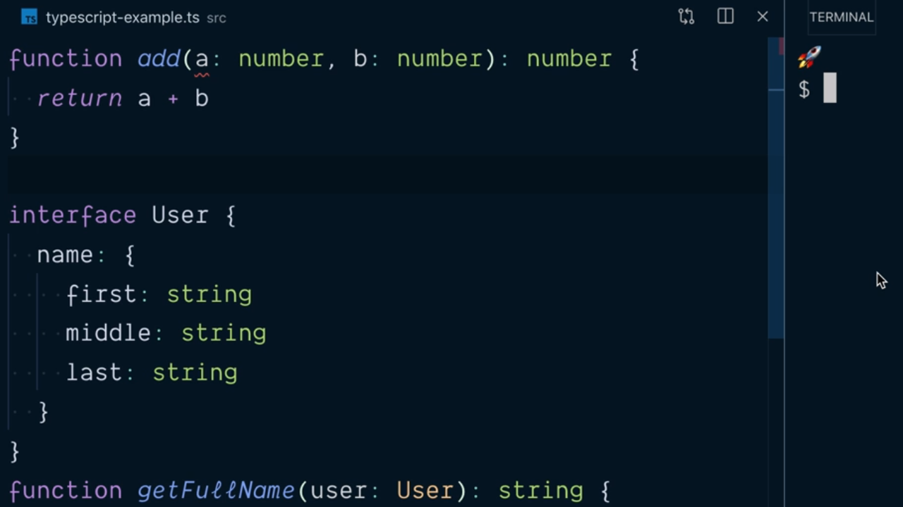
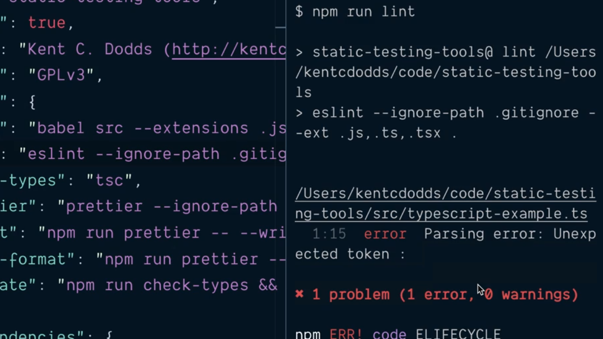
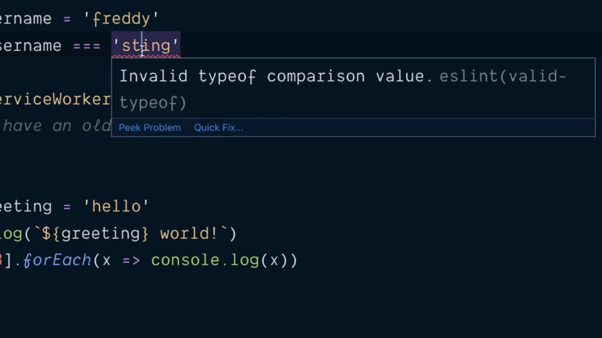
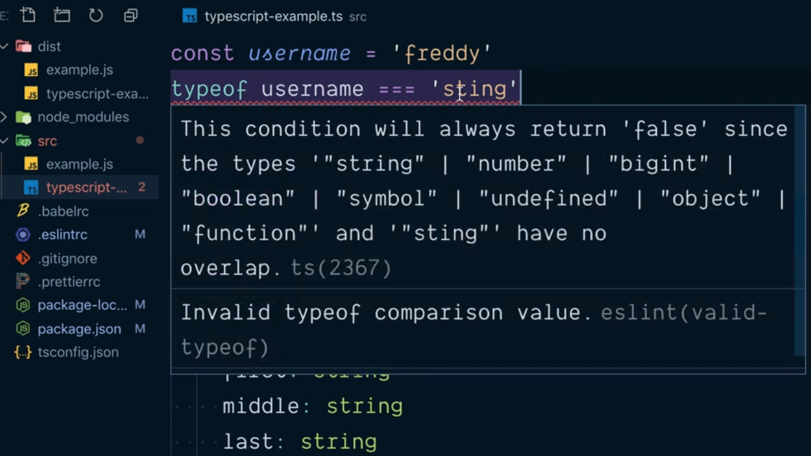
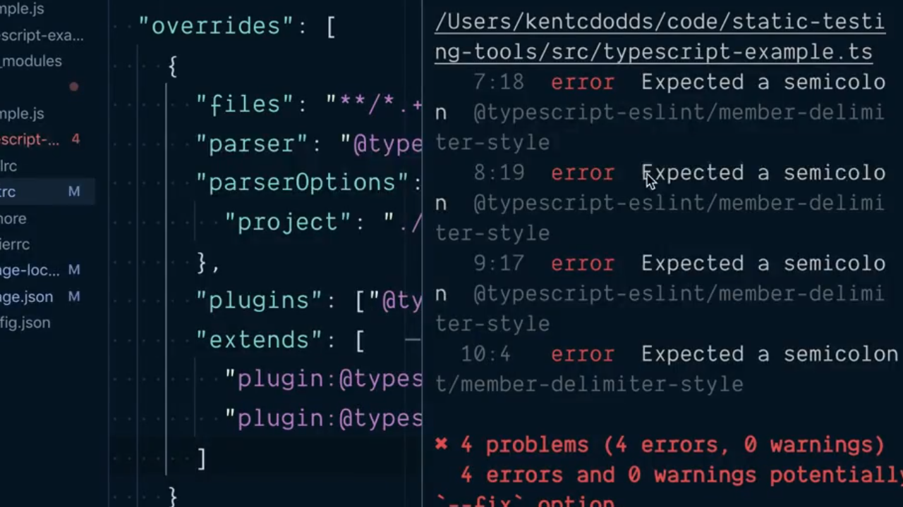
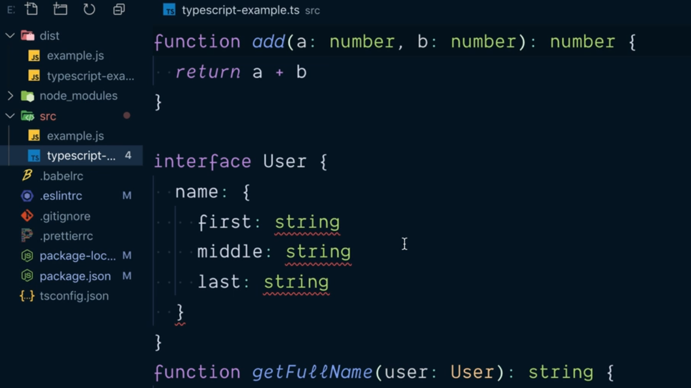
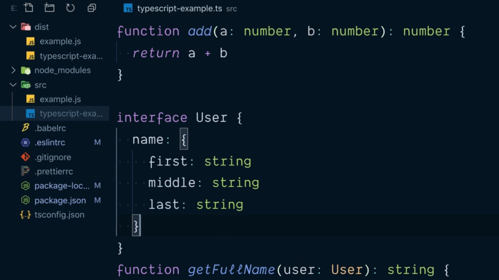
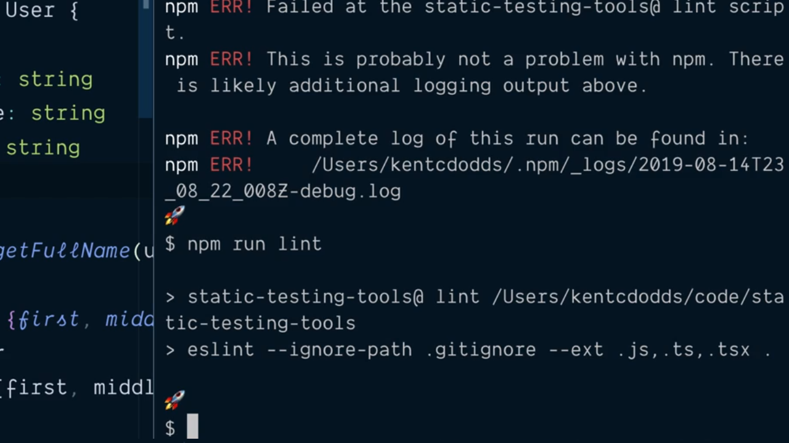

# Learn Make eslint Support TypeScript Files.

Llegados a este punto hemos visto cómo eslint es capaz de realizar el código estático de todos los archivos JavaScript que forman parte de nuestra aplicación pero no sabe cómo trabajar con los ficheros TypeScript que podamos tener. De hecho, pese a que dentro de VSCode podemos ver cómo se nos muestra un error en rojo de análisis de código estático al inicio de la definición de nuestro fichero TypeScript:

```ts
function add(a: number, b: number) {
  return a + b
}

interface User {
  name: {
    first: string
    middle: string
    last: string
  }
}

function getFullName(user: User): string {
  const {
    name: { first, middle, last }
  } = user
  return [first, middle, last].filter(Boolean).join(' ')
}

add(1, 2)
getFullName({ name: { first: 'Joe', middle: 'Bud', last: 'Mathews' }})
```

De hecho si abrimos este fichero con VSCode vemos como el editor nos informará de que existe un error de análisis de código estático al inicio del mismo:

<div style='text-align: center'>
  
</div>
<br />

si ejecutamos el script que nos va a permitir realizar el anális de código estático veremos que eslint no nos informará de ningún tipo de error:

<div style='text-align: center'>
  
</div>
<br />

Una de las cosas que tenemos que entender es que TypeScript hace que muchas de las reglas que añade eslint para la verificación del código estático sean innecesarias ya que es el propio lenguaje el que va a garantizar que se van a cumplir pero aún así existen algunas otras reglas que siguen siendo muy interesantes utilizar trabajando con TypeScript.

Lo primero que vamos a indicarle a eslint es que tiene que ser capaz de realizar el anális del código estático del código fuente de todos aquellos archivos del proyecto que están escritos en TypeScript y así evitar el error que hemos visto en la imagen anterior donde el parámetro `a` de la función `add` aparece subrayado. Para lograrlo tenemos que instalar unas nuevas dependencias de desarrollo dentro de nuestro proyecto:

```console
$ npm install --save-dev @typescript-eslint/eslint-plugin @typescript-eslint/parser
  + @typescript-eslint/eslint-plugin@2.0.0
  + @typescript-eslint/parser@2.0.0
  [...]
```

Una vez finaliza la instalación vamos a modificar la invocación del script `lint` dentro del fichero `package.json` con el fin de indicarle a eslint que ha de ser capaz de realizar el análisis del código estático de los ficheros que contienen la extensión `.ts` o `.tsx` propias de TypeScript para lo cual vamos a utilizar el flag `--ext` la cual espera recibir la lista de las extesiones de los ficheros sobre los cuales va a tener que trabajar para lograr su objetivo:

```json
"scripts": {
  "build": "babel src  --extensions .js,.ts,.tsx --out-dir dist",
  "lint": "eslint --ignore-path .gitignore --ext .js,.ts,.tsx .",
  "check-types": "tsc",
  "prettier": "prettier --ignore-path .gitignore \"**/*.+(js|json|ts|tsx)\"",
  "format": "npm run prettier -- --write",
  "check-format": "npm run prettier -- --list-different",
  "validate": "npm run check-types && npm run check-format && npm run lint && npm run built"
},
```

Si ahora ejecutamos nuevamente el script `lint` podremos ver que eslint se está ejecutando también sobre los fichero `.ts` y en este caso nos retorna un error como sucede con VSCode.

<div style='text-align: center'>
  
</div>
<br />

El siguiente paso que vamos a tener que llevar a cabo es permitir que TypeScript se ejecute no solamente sobre los ficheros JavaScript sino que queremos que se tenga en cuenta para los ficheros propios de TypeScript lo primero que vamos a hacer es modificar continido del fichero de configuración para eslint (el fichero `.eslintrc`) añadiendo al objeto JSON una nueva propiedad para el caso de los fichero TypeScript. Partimos de lo siguiente:

```json
{
  "parseOptions": {
    "ecmaVersion": 2019,
    "sourceType": "module",
    "ecmaFeatures": {
      "jsx": true
    }
  },
  "extends": [
    "eslint:recommended",
    "eslint-config-prettier"
  ],
  "rules": {
    "strict": ["error", "never"]
  },
  "env": {
    "browser": true
  }
}
```

Y lo que hacemos añadir el atributo `overrides` el cual espera tener como valor asociado un array donde cada uno de los elementos será a su vez objetos que representarán las opciones de configuración para determinados tipos de ficheros que queremos sobreescribir con respecto a las opciones de configuración iniciales.

Estos objetos tiene el atributo `files` al cual se le asignará un string que ha de contener el formato de los ficheros para los cuáles aplicará la configuración. Como en nuestro caso lo que queremos hacer es que esta nueva configuración afecte a los ficheros con el código TypeScript escribiremos el comodín que los englobará a todos ellos:

```json
"overrides": [
  {
    "files": "**/*.+(ts|tsx)"
  }
]
```

El siguiente atributo será `parser` y sirve para indicar qué parser queremso que aplique eslint para realizar el análisis del código estático de los ficheros que cumplen con el formato que acabamos de especificar que en nuestro caso se será el que se corresponde con una de las dos dependencias de desarrollo que acabamos de instalar:

```json
"overrides": [
  {
    "files": "**/*.+(ts|tsx)",
    "parser": "@typescript-eslint/parser"
  }
]
```

El lo que respecta las opciones que ha de utilizar el parser tenemso que hacer uso de otro de los atributosque posee el objeto `parserOptions` y en nuestro caso le tenemos que indicar dónde se encuentra ubicado el fichero con las configuración para el compilador de TypeScript que aplica en el proyecto. Esta propiedad acepta a su vez como valor un objeto y dentro del mismo es en el atributo `project` en el que se tenemos que indicarle el path al fichero con la configuración:

```json
"overrides": [
  {
    "files": "**/*.+(ts|tsx)",
    "parser": "@typescript-eslint/parser",
    "parserOptions": {
      "project": "./tsconfig.json"
    }
  }
]
```

El siguiente atributo a configurar dentro del objeto del array `overrides` es `pluging` donde se espera recibir un array en el que podemos especificar todos aquellos plugins para la extensión que han de aplicar a la misma. En nuestro caso queremos aplicar el plugin que hemos instalado como una dependencia de desarrollo el cual contiene una serie de reglas para eslint que tienen que ver exclusivamente con el análisis del código estático de los fichero TypeScript. Por lo tanto escribiremos:

```json
"overrides": [
  {
    "files": "**/*.+(ts|tsx)",
    "parser": "@typescript-eslint/parser",
    "parserOptions": {
      "project": "./tsconfig.json"
    },
    "plugins": [
      "@typescript-eslint/eslint-plugin"
    ]
  }
]
```

Además hacemos uso del atributo `extends` donde en un array vamos a poder indicar qué reglas de configuración estaremos extendiendo (es decir, qué reglas queremos que apliquen de forma determinada sin que nosotros tengamos que hacer nada al respecto). En nuestro caso escribiremos:

```json
"overrides": [
  {
    "files": "**/*.+(ts|tsx)",
    "parser": "@typescript-eslint/parser",
    "parserOptions": {
      "project": "./tsconfig.json"
    },
    "plugins": [
      "@typescript-eslint/eslint-plugin"
    ],
    "extends": [
      "plugin:@typescript-eslint/eslint-recommended",
      "plugin:@typescript-eslint/recommended"
    ]
  }
]
```

En otras palabras que el el conjunto de las reglas que queremos que sean veficadas por eslint cuando se encuentra con un fichero con código TypeScript van a ser las que están recogidas en el el plugin `@typescript-eslint` aplicando en primer lugar `eslint-recommened` y luego sobreescribiéndolas con las que pueda haber en el conjunto de reglas `recommened` de este mismo plugin.

---
**Nota:** para poder entender qué es lo que hacen este conjunto de reglas predeterminadas tenemos que ver qué es lo que pasa en nuestro código TypeScript cuando no están habilitadas. Recordemos que en el caso de un archivo JavaScript con un error a la hora de realizar una comparación para determinar el tipo de datos de una variable:

```js
const username = 'freddy'
typeof username === 'sting'
```

hace que dentro de un editor como VSCode al estar el tipo de datos que está mal escrito, aparecerá subrayado en rojo como podemos ver en la siguiente imagen:

<div style='text-align: center'>
  
</div>
<br />

Un error similar pero en este caso en un fichero TypeScript no provoca únicamente un error de anáisis de código estático sino dos: uno por el propio análisis que realiza TypeScript (el cual comprueba que no hay un tipo de datos `sting`) y otro el mismo que en el caso anterior pero esta vez lo emite eslint:

<div style='text-align: center'>
  
</div>
<br />

Ante una situación como la anterior lo que tenemos que entender es que TypeScript realizar el análisis estáticos de los tipos de datos mucho mejor de lo que lo puede hacer eslint es la razón por la que se habilita el primero del conjunto de las dos reglas que establecemos en el fichero de configuración `eslint-recommended` ya que lo que hace es deshabilitar todas aquellas reglas de eslint que ya deja de ser necesario comprobar lo que hará que en situaciones como la que acabamos de describir únicamente aparezca un error (el de TypeScript).

El segundo conjunto de reglas que habilitaremos dentro del pluging `reccommended` son aquellas que van a permitir realizar el análisis del código estático pero para todos aquellos aspectos de nuestro código que tienen que ver exclusivamente con el código TypeScript, como pueden ser la forma en la que escribimos las interfaces.

---

Si ahora grabamos el fichero y volvemos a ejecutar el script que nos va a perminir ejecutar estlint desde la terminal del sistema:

```console
$ npm run lint
```

en la salida que obtenemos sigue habiendo errores como podemos ver en la siguiente imagen:

<div style='text-align: center'>
  
</div>
<br />

De hecho el error que se nos muestra es siempre el mismo *Expected semicolon* como consecuencia de que el conjunto de reglas de eslint para TypeScript que hemos definido por defecto espera encontrarse con un punto y coma para deliminar los atributos que definen un tipo de datos (en nuestro ejemplo una interfaz):

<div style='text-align: center'>
  
</div>
<br />

Sin embargo esta es una regla estilística ya que no influye en el funcionamiento del programa en sí mismo y, como hemos visto en los puntos anteriores, en nuestro proyecto hemos instalado como dependecia de desarrollo `eslint-config-prettier` para de alguna manera eliminar todas aquellas reglas de eslint que tienen que ver con temas de estilo del código que estamos solventando con Prettier.

Pues bien, el haber definido un `override` para eslint relacionado con los ficheros TypeScript lo que sucede es que la aplicación de este conjunto de reglas estilísticas dejan de tener efecto y por lo que tanto tenemos que indicar que se apliquen (en último lugar para que sobreescriban cualquier otra) cuando se está utilizando eslint para el análisis del código estático en los ficheros propios de TypeScript, pero no totas ellas, sino únicamente el subconjunto de las mismas que tienen que ver con TypeScript. Esto se expresa de la siguiente manera:

```json
"overrides": [
  {
    "files": "**/*.+(ts|tsx)",
    "parser": "@typescript-eslint/parser",
    "parserOptions": {
      "project": "./tsconfig.json"
    },
    "plugins": [
      "@typescript-eslint/eslint-plugin"
    ],
    "extends": [
      "plugin:@typescript-eslint/eslint-recommended",
      "plugin:@typescript-eslint/recommended",
      "eslint-config-prettier/@typescript-eslint"
    ]
  }
]
```

Tras hacerlo si abrimos de nuevo el fichero con el que estamos trabajando en VSCode veremos cómo ya nos aparecen los subrayados dentro de la declaración de los atributos de la interface:

<div style='text-align: center'>
  
</div>
<br />

Y no solamente eso sino que si además volvemos a invocar al script que nos permite ejecutar eslint desde la línea de comandos no nos aparecerá ningún tipo de error:

<div style='text-align: center'>
  
</div>
<br />

El contenido final del fichero `.eslintrc` tras aplicar las opciones de configuración será el que se muestra a continuación:

```json
{
  "parseOptions": {
    "ecmaVersion": 2019,
    "sourceType": "module",
    "ecmaFeatures": {
      "jsx": true
    }
  },
  "extends": [
    "eslint:recommended",
    "eslint-config-prettier"
  ],
  "rules": {
    "strict": ["error", "never"]
  },
  "env": {
    "browser": true
  },
  "overrides": [
  {
    "files": "**/*.+(ts|tsx)",
    "parser": "@typescript-eslint/parser",
    "parserOptions": {
      "project": "./tsconfig.json"
    },
    "plugins": [
      "@typescript-eslint/eslint-plugin"
    ],
    "extends": [
      "plugin:@typescript-eslint/eslint-recommended",
      "plugin:@typescript-eslint/recommended",
      "eslint-config-prettier/@typescript-eslint"
    ]
  }
]
}
```

Y, como hemos hecho en los puntos anteriores, el contenido del fichero `package.json` hasta este punto dentro del fichero tendrá el siguiente aspecto:

```json
{
  "name": "static-testing-tools",
  "private": true,
  "author": "Kent C. Dodds (http://kentcdodds.com/)",
  "license": "GPLv3",
  "scripts": {
    "build": "babel src  --extensions .js,.ts,.tsx --out-dir dist",
    "lint": "eslint --ignore-path .gitignore --ext .js,.ts,.tsx .",
    "check-types": "tsc",
    "prettier": "prettier --ignore-path .gitignore \"**/*.+(js|json|ts|tsx)\"",
    "format": "npm run prettier -- --write",
    "check-format": "npm run prettier -- --list-different",
    "validate": "npm run check-types && npm run check-format && npm run lint && npm run built"
  },
  "devDependencies": {
    "@babel/cli": "^7.5.5",
    "@babel/core": "^7.5.5",
    "@babel/preset-env": "^7.5.5",
    "@babel/preset-typescript": "^7.3.3",
    "@typescript-eslint/eslint-plugin": "^2.0.0",
    "@typescript-eslint/parser": "^2.0.0",
    "eslint": "^6.1.0",
    "eslint-config-prettier": "^6.0.0",
    "prettier": "^1.18.2",
    "typescript": "^3.5.3"
  }
}
```

<br />

----
<div>
  <div style="float: left">
    <a href="./02_11.md">
      < Avoid Common Errors by Installing and Configuring TypeScript
    </a>
  </div>
  <div style="float: right">
    <a href="./02_13.md">
      Validate Code in a Pre Commit git Hook with Husky >
    </a>
  </div>
</div>
