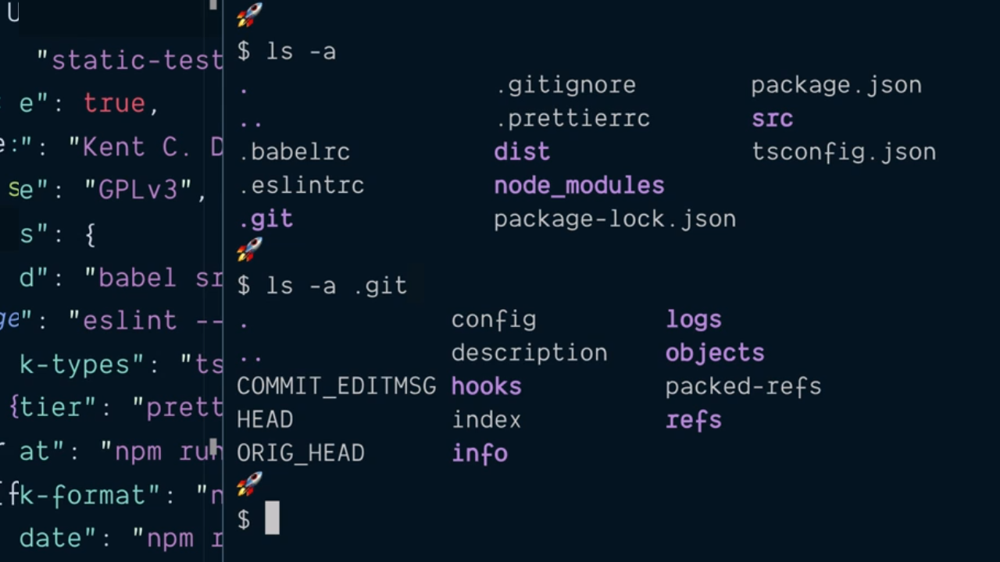
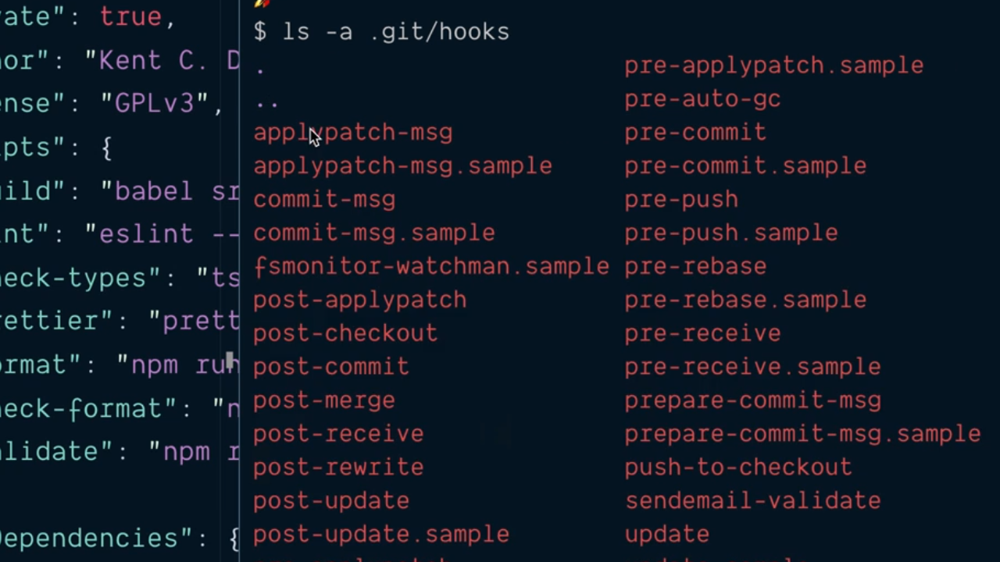
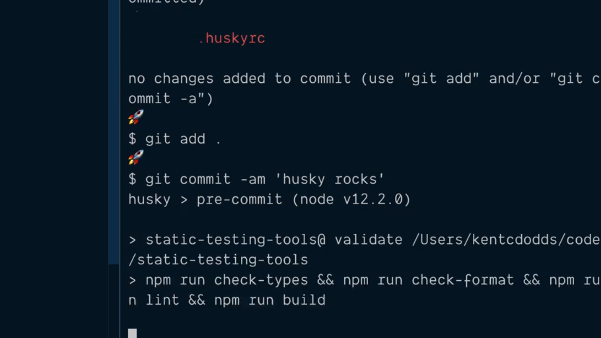
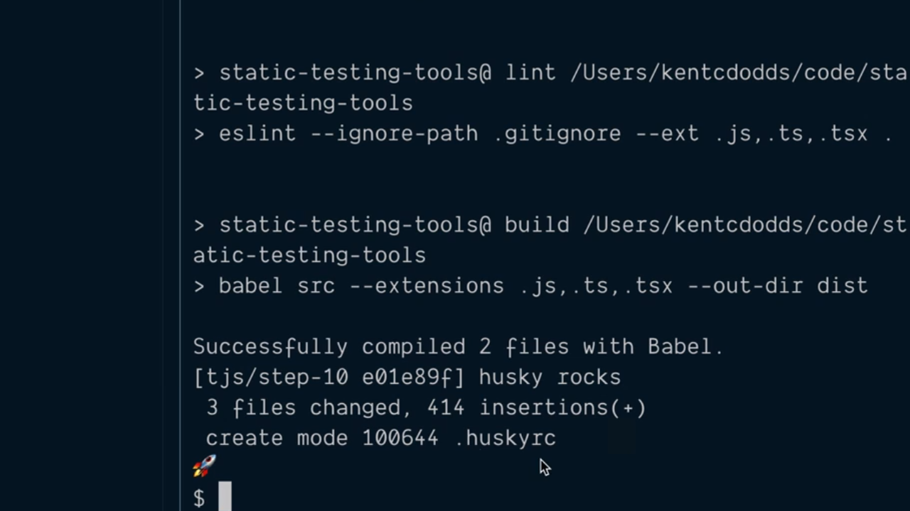
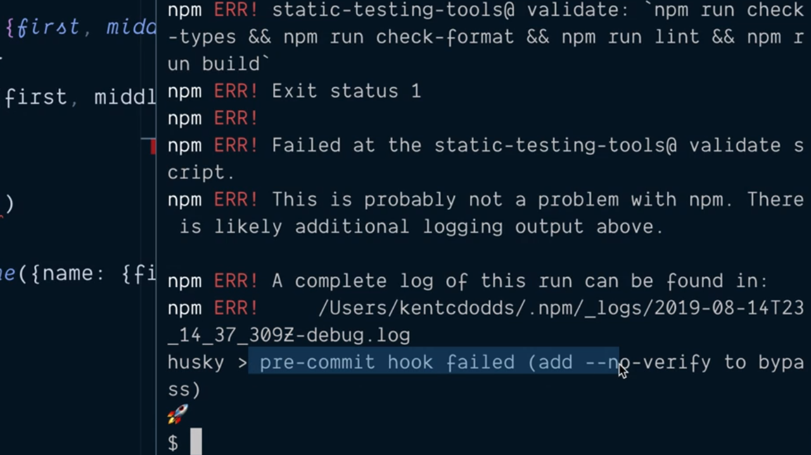

# Validate Code in a Pre Commit git Hook with Husky.

Hasta ahora hemos visto cómo crear el script `validate` que se encargará de realizar todos los pasos de verificación de nuestro código relacionados con el analisis del código estático pero lo realmente interesante sería añadir la capacidad de que este script fuese invocada cada vez que alguien quiere hacer un commit dentro del proyecto de tal manera que dicho commit sea rechazado en el caso de que se produzca algún error durante la ejecución del script.

La forma de poderlo llevar a cabo es mediante la instalación de una nueva dependencia de desarrollo en este caso de **[Husky](https://github.com/typicode/husky)**. Lo primero que hacemos, como en otros casos, es instalarla:

```console
$ npm install --save-dev husky
  + husky@3.0.3
  [...]

  husky > Setting up git hooks
  husky > Done

  [...]
```

Si analizamos el proceso de instalación de la librería vemos que que realizar un paso denominado *Setting up git hooks* como parte del proceso de instalación. ¿Qué es lo que esto quiere decir? Pues para entenderlo tenemos que hacer un listado de todo el contenido del directorio que contiene el proyecto donde hemos realizado la instalación y más concretamente en el directorio `.git` (directorio que contiene el repositorio local a nuestra aplicación) si vemos lo que hay dentro del mismo listando su contenido:

<div style='text-align: center'>
  
</div>
<br />

De entre toda la información que tenemos en el directorio nos interesa el contenido del subdirectorio `hooks` donde si listamos su contenido veremos que tenemos una contidad considerable de ficheros que Husky habrá creado por nosotros dentro de nuestro repositorio:

<div style='text-align: center'>
  
</div>
<br />

y que vamos a poder utilizar dentro de nuestro fichero de configuración de Husky para que pueda ser utilizado por la librería. Este fichero de configuración sigue un patrón de nombrado similar al que ya hemos visto en el caso de los ficheros de configuración para otras librerías por lo que el nombre del mismo será `.huskyrc` y dentro del mismo esperamos encontrar un objeto JSON donde iremos realizadno la configuración.

Mediante el atributo `hooks` de este objeto JSON vamos a poder establecer el valor de los direntes hooks que queremos utilizar. El atributo espera recibir un objeto como valor donde cada uno de sus atributos se corresponde a los direferentes hooks que queremos configurar (entendiendo que cada uno de estos hooks, el nombre de los atributos, se correspondenrá con el nombre de los ficheros que hemos visto dentro del directorio `.git/hooks`). Así, como nosotros queremos que se ejecute un script de npm previamente a que se realice el commit el hook que se ha de ejecutar es `pre-commit` y como valor que tendrá asociado tenemos que indicarle el comando que queremos que sea ejecutado:

```json
{
  "hooks": {
    "pre-commit": "npm run validate"
  }
}
```

---
**Nota:** aquí lo que es importante entender que el directorio `.git/hooks` está construido dentro de la propia herramienta git y que es ella la que se encargará de ver dentro de este directorio qué script (hooks) hay para ejecutarlos en el momento adecuado.

---
**Nota:** no vamos a ver todos los posibles hooks que nos ofrece Husky por lo que dejamos al lector que esté interesado en profundizar en ellos que acuda a la [documentación oficial](https://typicode.github.io/husky/#/) de la librería.

---

Con esto cuando estamos haciendo un commit al proyecto en Git gracias a las hooks que ha creado Husky lo que la herramienta hace es buscar en la raíz del proyecto si existe el archivo `.huskyrc` y si dentro del mismo existe una configuración para el hook que se va a ejecutar de tal manera que si es así ejecutará la instrucción que tiene asociada, lo que se traduce, en nuestro caso, que si se produce un error durante el proceso de validación (ejecutación del script `validate`) el proceso terminará y por lo tanto no se llevará a cabo el commit.

Si ahora guardamos los cambios en nuestro proyecto, los añadimos al repositorio y posteriormente realizamos un commit veremos como previamente a la realización del commit en sí mismo se estará ejecutando el hook que hemos definido:

<div style='text-align: center'>
  
</div>
<br />

y no solamente eso sino que como la ejecución del script `validate` se ejecuta correctamente el commit habrá sido creado sin problemas dentro de la librería:

<div style='text-align: center'>
  
</div>
<br />

Supongamos que tenemos un error en uno de los ficheros que forman parte de nuestro proyecto y que vamos a querer realizar un nuevo commit dentro del mismo veremos que como este fallará y por lo tanto no se realizará el commit dentro del repositorio:

<div style='text-align: center'>
  
</div>
<br />

---
**Nota:** de cualquier manera existen situaciones en las que necesitamos añadir el commit al repositorio pese a que no se pase el hook. Para esto git nos proporciona el flag `--no-verify` a la hora hora realzar el commit lo que hará que no se ejecute ningún hook. Así, si en nuestro ejemplo con el error de validación utilizamos el flag, el código se añadirá al repositorio (commit) sin problemas:

<div style='text-align: center'>
  
</div>
<br />

---

Como en los otros puntos del capítulo en los que hemos realizado modificaciones en el fichero `package.json` a continuación mostramos el contenido del mismo tras haber añadido Husky:

```json
{
  "name": "static-testing-tools",
  "private": true,
  "author": "Kent C. Dodds (http://kentcdodds.com/)",
  "license": "GPLv3",
  "scripts": {
    "build": "babel src  --extensions .js,.ts,.tsx --out-dir dist",
    "lint": "eslint --ignore-path .gitignore --ext .js,.ts,.tsx .",
    "check-types": "tsc",
    "prettier": "prettier --ignore-path .gitignore \"**/*.+(js|json|ts|tsx)\"",
    "format": "npm run prettier -- --write",
    "check-format": "npm run prettier -- --list-different",
    "validate": "npm run check-types && npm run check-format && npm run lint && npm run built"
  },
  "devDependencies": {
    "@babel/cli": "^7.5.5",
    "@babel/core": "^7.5.5",
    "@babel/preset-env": "^7.5.5",
    "@babel/preset-typescript": "^7.3.3",
    "@typescript-eslint/eslint-plugin": "^2.0.0",
    "@typescript-eslint/parser": "^2.0.0",
    "eslint": "^6.1.0",
    "eslint-config-prettier": "^6.0.0",
    "husky": "^3.0.3",
    "prettier": "^1.18.2",
    "typescript": "^3.5.3"
  }
}
```

<br />

----
<div>
  <div style="float: left">
    <a href="./02_12.md">
      < Learn Make eslint Support TypeScript Files
    </a>
  </div>
  <div style="float: right">
    <a href="./02_14.md">
      Auto Format All Files and Validate Relevant Files in a Pre Commit Script >
    </a>
  </div>
</div>
