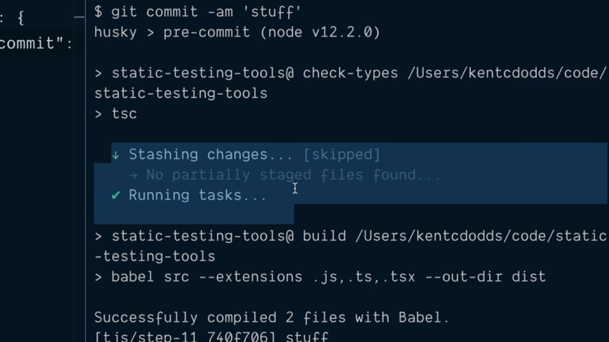

# Auto Format All Files and Validate Relevant Files in a Pre Commit Script.

En el punto anterior hemos visto cómo podemos hacer uso de Husky para poder ejecutar un script de npm antes de que se lleve a cabo la operación de commit sobre nuestro repositorio. Recordemos además que el script que se va a ejecutar es `validate` y este ejecutará los siguientes comandos que están incluidos en el fichero `package.json`:

```json
"scripts": {
  "build": "babel src  --extensions .js,.ts,.tsx --out-dir dist",
  "lint": "eslint --ignore-path .gitignore --ext .js,.ts,.tsx .",
  "check-types": "tsc",
  "prettier": "prettier --ignore-path .gitignore \"**/*.+(js|json|ts|tsx)\"",
  "format": "npm run prettier -- --write",
  "check-format": "npm run prettier -- --list-different",
  "validate": "npm run check-types && npm run check-format && npm run lint && npm run built"
},
```

es decir, que si falla la tarea de chequear que nuestro código está correctamente formateado con Prettier el script completo fallará lo que nos obligará a ejecutar el script `format` para que lo formatee y luego volver a intentar realizar el commit. Ahora bien, si lo pensamos detenidamente, el formateo del código es algo que tendremos que hacer que se lleve a cabo siempre haya errores de formato o no por lo que parece bastante interesante intentar averiguar si existe un mecanismo que nos permita realizarlo siempre sin impotar si hace falta realizarlo o no, garantizándonos de esta manera que el código siempre estará formateado siguiendo las reglas de Prettier.

Para lograr vamos a tener que instalar una nueva librería como una dependencia de desarrollo denominada **[lint-staged](https://github.com/okonet/lint-staged)** por lo que desde la línea de comandos ejecutamos lo siguiente:

```console
$ npm install --save-dev lint-staged
  +lint-staged@9.2.1
  [...]
```

Lo que hace que ahora esta librería aparezca como una dependencia de desarollo dentro del fichero `package.json`:

```json
"devDependencies": {
  "@babel/cli": "^7.5.5",
  "@babel/core": "^7.5.5",
  "@babel/preset-env": "^7.5.5",
  "@babel/preset-typescript": "^7.3.3",
  "@typescript-eslint/eslint-plugin": "^2.0.0",
  "@typescript-eslint/parser": "^2.0.0",
  "eslint": "^6.1.0",
  "eslint-config-prettier": "^6.0.0",
  "husky": "^3.0.3",
  "lint-staged": "^9.2.1",
  "prettier": "^1.18.2",
  "typescript": "^3.5.3"
}
```

Para poder utilizar esta librería lo primero que tenemos que hacer es crear el fichero con sus opciones de configuración lo que nos obliga a crear un archivo en el directorio raíz del proyecto denominado `.lintstagedrc` (siguiendo los mismos criterios de nomenclatura que se siguen para otros ficheros de configuración dentro del proyecto). Dento de este fichero tenemos que definir un objeto JSON en el que como atributos debemos especificar con un comodín los tipos de ficheros que queremos tener en cuenta. En nuestro caso como las opciones que vamos a configurar han de aplicarse sobre los ficheros `.js` (JavaScript), `.ts` (TypeScript) y `.tsx` (TypeScript JSX) mediante los caracteres comodín especificaremos que los ha de tener en cuenta:

```json
{
  "*.+(js|ts|tsx)": []
}
```

¿Qué vamos le tenemos que asignar a este atributo? Pues cada uno de los elementos del array ha de ser un string que identifique el comando que queremos que sea ejecutado antes de realizar el commit sobre los ficheros que cumplen esta extensión (o extensiones). Así, como queremos que se lleve a cabo el análisis del código estático sobre ellos lo que indicaremos como elemento del array es `eslint` es decir, el comando que se va a ejecutar:

```json
{
  "*.+(js|ts|tsx)": ["eslint"]
}
```

Lo siguiente que queremos que se lleve a cabo es que se formetee el código con Pretteier de todos los formatos de ficheros que soporta esta herramienta. Por lo tanto creamos un nuevo atributo utilizando los comodines necesarios para poder identificar todos los archivos sobre los que se aplicará el formateo de los datos y, como queremos formatearlos, el array que tendrá asociado estará formado por un único elemento que contendrá la invocación de Prettier con el flag `--write` para que corrija todos aquellos que sea necesario corregir:

```json
{
  "*.+(js|ts|tsx)": ["eslint"],
  "**/*.+(js|json|ts|tsx)": [
    "prettier --write"
  ]
}
```

Y no solamente esto sino que además vamos a indicarle que una vez que finalice añada los cambios a la staged area de git para que así puedan ser incluidos en el commit. Esto se logra pasando como segundo elemento del array la invocación del comando de git que permitirá añadirlos:

```json
{
  "*.+(js|ts|tsx)": ["eslint"],
  "**/*.+(js|json|ts|tsx)": [
    "prettier --write",
    "git add"
  ]
}
```

Con esto ya tenemos configurado las opciones que queremos que se lleven a cabo pero ¿quién será el encargado de que esta herramienta realmente se ejecute antes de que se lleve a cabo el commit? La respuesta es que esto lo vamos a lograr gracias a Husky. Tenemos que recordar que las opciones de configuración para el mismo se encuentran recogidas dentro del fichero `.huskyrc` y que actualmente está formado por lo siguiente:

```json
"hooks": {
  "pre-commit": "npm run validate"
}
```

¿Qué es lo que tendremos que hacer? Pues que en vez de que se ejecute este script de npm lo que queremso que se lleve a cabo es la ejecución de lint-staged antes de que se lleve a cabo el commit, por lo que modificamos el contenido del mismo para que quede de la siguiente manera:

```json
"hooks": {
  "pre-commit": "lint-staged"
}
```

Teniendo en cuenta que gracias a la configuración que hemos realizado para lint-staged se va a llevar a cabo el análisis del código estático de nuestro código así como el formateo del mismo estamos eliminando los pasos de los script npm `validate` que se encargada de realizar las validaciones de los tipos de datos en nuestra aplicación (gracias a TypeScript) y de la construcción del entegable (gracias a la ejecución de Babel). Por lo tanto, si queremos que además se lleven a cabo estos pasos tenemos que incluirlos en la lista de comandos que estárán recogidos en valor que se le asignará al atributo `pre-commit` de la siguiente manera:

```json
"hooks": {
  "pre-commit": "npm run check-types && lint-staged && npm run build"
}
```

Si ahora guardamos todos los cambios que hemos realizado en el código y hacemos un commit podemos ver cómo se ejecutarán los distintos pasos que hemos descrito en Husky:

<div style='text-align: center'>
  
</div>
<br />

donde podemos ver como se ejecuta `tsc` ya que es el comando que ejecuta el script de npm `check-types`, a continuación se ejecutará lint-staged para finalizar ejecutando el script `build` del proyecto que lo que hace es ejecutar Babel para obtener el entregable de la aplicación.

Aquí lo que tenemos que entender y que hace especialmente interesante el uso de lint-staged es que únicamente ejecutará las tareas que se indican y configuran para el mismo siempre y cuando hayan cambiado y por lo tanto se encuentren dentro del staged area de git (es decir, que para los archivos que no hayan sido añadidos al staged area o que no haya sido modificados no se realizará ninguna tarea).

Nuevamente volvemos a mostrar el contenido completo del fichero `package.json` con el fin de tener agrupada la información en el mismo sitio:

```json
{
  "name": "static-testing-tools",
  "private": true,
  "author": "Kent C. Dodds (http://kentcdodds.com/)",
  "license": "GPLv3",
  "scripts": {
    "build": "babel src  --extensions .js,.ts,.tsx --out-dir dist",
    "lint": "eslint --ignore-path .gitignore --ext .js,.ts,.tsx .",
    "check-types": "tsc",
    "prettier": "prettier --ignore-path .gitignore \"**/*.+(js|json|ts|tsx)\"",
    "format": "npm run prettier -- --write",
    "check-format": "npm run prettier -- --list-different",
    "validate": "npm run check-types && npm run check-format && npm run lint && npm run built"
  },
  "devDependencies": {
    "@babel/cli": "^7.5.5",
    "@babel/core": "^7.5.5",
    "@babel/preset-env": "^7.5.5",
    "@babel/preset-typescript": "^7.3.3",
    "@typescript-eslint/eslint-plugin": "^2.0.0",
    "@typescript-eslint/parser": "^2.0.0",
    "eslint": "^6.1.0",
    "eslint-config-prettier": "^6.0.0",
    "lint-staged": "^9.2.1",
    "husky": "^3.0.3",
    "prettier": "^1.18.2",
    "typescript": "^3.5.3"
  }
}
```

<br />

----
<div>
  <div style="float: left">
    <a href="https://github.com/DevJoseManuel/js-tutorials/blob/master/testing/ch02/02_13.md">
      < Validate Code in a Pre Commit git Hook with Husky
    </a>
  </div>
  <div style="float: right">
    <a href="https://github.com/DevJoseManuel/js-tutorials/blob/master/testing/ch02/02_15.md">
      Run Multiple npm Script in Parallel >
    </a>
  </div>
</div>
