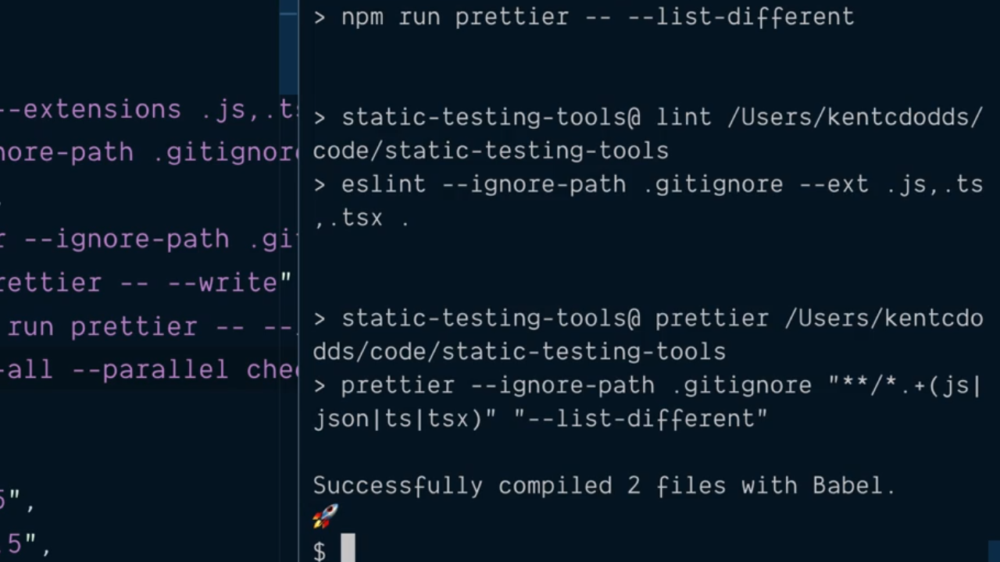

# Run Multiple npm Script in Parallel.

Si nos fijamos en los scripts que tenemos en recogidos dentro del fichero `package.json` del proyecto y más concretamente en el script `validate` vemos que dentro del mismo se está invocando la ejecución de varios script uno a continuación de otro:

```json
"scripts": {
  "build": "babel src  --extensions .js,.ts,.tsx --out-dir dist",
  "lint": "eslint --ignore-path .gitignore --ext .js,.ts,.tsx .",
  "check-types": "tsc",
  "prettier": "prettier --ignore-path .gitignore \"**/*.+(js|json|ts|tsx)\"",
  "format": "npm run prettier -- --write",
  "check-format": "npm run prettier -- --list-different",
  "validate": "npm run check-types && npm run check-format && npm run lint && npm run built"
},
``` 

Parece interesenate pensar en que sería una buena opción disponer de algún tipo de herramienta que nos permitiese ejecutarlos en paralelo de tal manera que todas las tareas se ejecuten mucho más rápido y así poder sacer un mayor provecho de los recursos que disponemos. Para lograrlo vamos a utilizar la librería **[npm-run-all](https://github.com/mysticatea/npm-run-all)** la cual vamos a instalar como una dependencia de desarrollo dentro de nuestro proyecto:

```console
$ npm install --save-dev npm-run-all
  +npm-run-all@4.1.5
  [...]
```

Una vez finalizada la instalación si ahora nos fijamos en las dependencias de desarrollo que tenemos recogidas en el proyecto nos encontraremos con la siguiente información dentro del fichero `package.json`:

```json
"devDependencies": {
  "@babel/cli": "^7.5.5",
  "@babel/core": "^7.5.5",
  "@babel/preset-env": "^7.5.5",
  "@babel/preset-typescript": "^7.3.3",
  "@typescript-eslint/eslint-plugin": "^2.0.0",
  "@typescript-eslint/parser": "^2.0.0",
  "eslint": "^6.1.0",
  "eslint-config-prettier": "^6.0.0",
  "lint-staged": "^9.2.1",
  "npm-run-all": "^3.0.2",
  "husky": "^3.0.3",
  "prettier": "^1.18.2",
  "typescript": "^3.5.3"
}
```

Tras la instalación de esta librería si nos dirigimos al directorio `.bin` dentro del directorio `node_modules` vamos veremos que nos aparece el fichero `npm-run-all` que es el CLI que nos a a permitir ejecutar la librería. ¿Qué es lo que nosotros queremos hacer? Pues simplemente ejecutarla como parte del script `validate` para que todos los scripts que hasta ahora la forman se ejecuten en paralelo siguiendo al flag `--parallel` que nos proporciona. Así pues escribiremos:

```json
"scripts": {
  "build": "babel src  --extensions .js,.ts,.tsx --out-dir dist",
  "lint": "eslint --ignore-path .gitignore --ext .js,.ts,.tsx .",
  "check-types": "tsc",
  "prettier": "prettier --ignore-path .gitignore \"**/*.+(js|json|ts|tsx)\"",
  "format": "npm run prettier -- --write",
  "check-format": "npm run prettier -- --list-different",
  "validate": "npm-run-all --parallel check-types check-format lint built"
}
```

Por lo tanto si ahora ejecutamos desde la línea de comandos el script `validate` al ser todos ellos ejecutados en paralelo se ejecutarán mucho más rápidamente:

<div style='text-align: center'>
  
</div>
<br />

El contenido completo del nuestro fichero `package.json` para el proyecto con el que estamos trabajando tendrá el aspecto que se muestra a continuación:

```json
{
  "name": "static-testing-tools",
  "private": true,
  "author": "Kent C. Dodds (http://kentcdodds.com/)",
  "license": "GPLv3",
  "scripts": {
    "build": "babel src  --extensions .js,.ts,.tsx --out-dir dist",
    "lint": "eslint --ignore-path .gitignore --ext .js,.ts,.tsx .",
    "check-types": "tsc",
    "prettier": "prettier --ignore-path .gitignore \"**/*.+(js|json|ts|tsx)\"",
    "format": "npm run prettier -- --write",
    "check-format": "npm run prettier -- --list-different",
    "validate": "npm run check-types && npm run check-format && npm run lint && npm run built"
  },
  "devDependencies": {
    "@babel/cli": "^7.5.5",
    "@babel/core": "^7.5.5",
    "@babel/preset-env": "^7.5.5",
    "@babel/preset-typescript": "^7.3.3",
    "@typescript-eslint/eslint-plugin": "^2.0.0",
    "@typescript-eslint/parser": "^2.0.0",
    "eslint": "^6.1.0",
    "eslint-config-prettier": "^6.0.0",
    "lint-staged": "^9.2.1",
    "npm-run-all": "^4.1.5",
    "husky": "^3.0.3",
    "prettier": "^1.18.2",
    "typescript": "^3.5.3"
  }
}
```


<br />

----
<div>
  <div style="float: left">
    <a href="./02_14.md">
      < Auto Format All Files and Validate Relevant Files in a Pre Commit Script
    </a>
  </div>
  <div style="float: right">
    <a href="./03_00.md">
      Chapter 3 >
    </a>
  </div>
</div>
