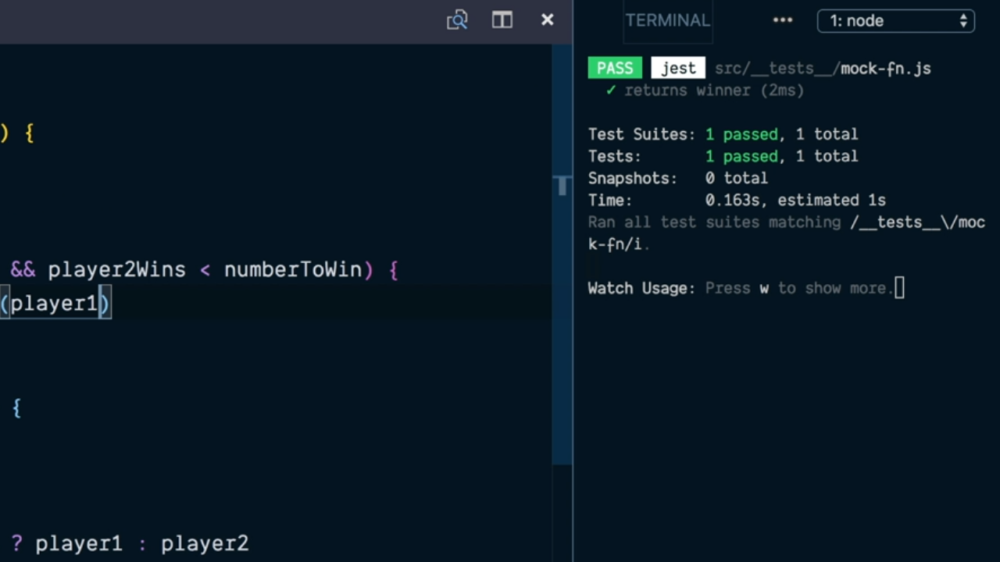
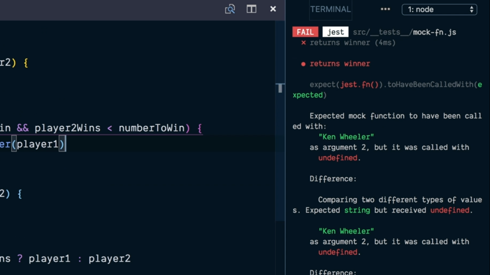
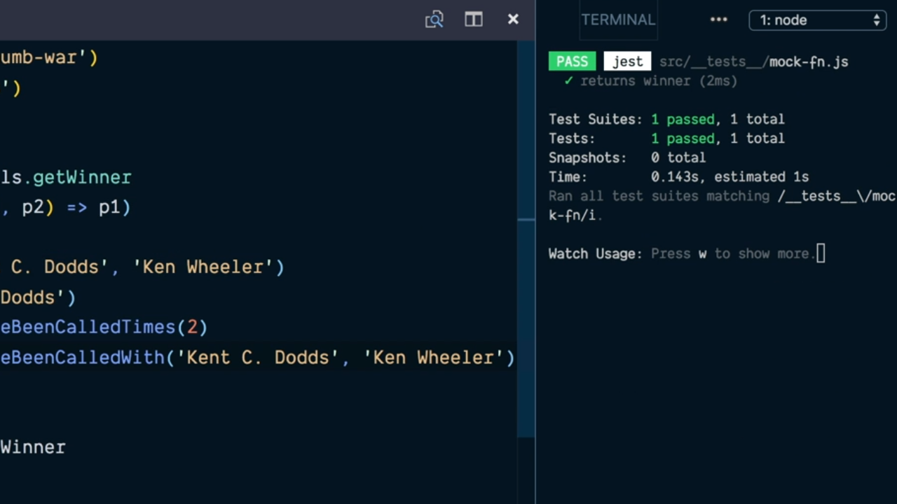
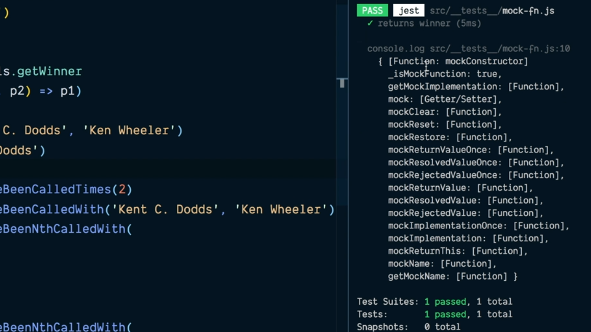
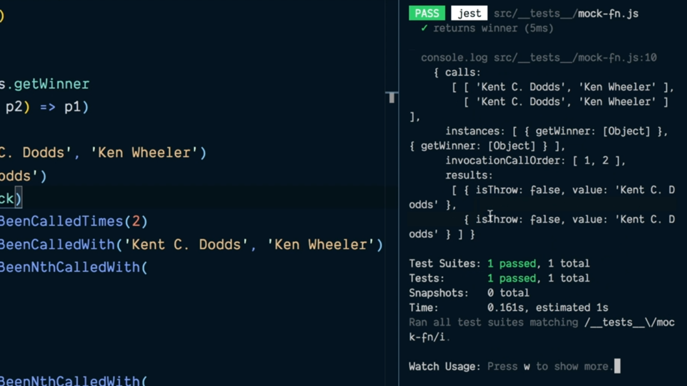
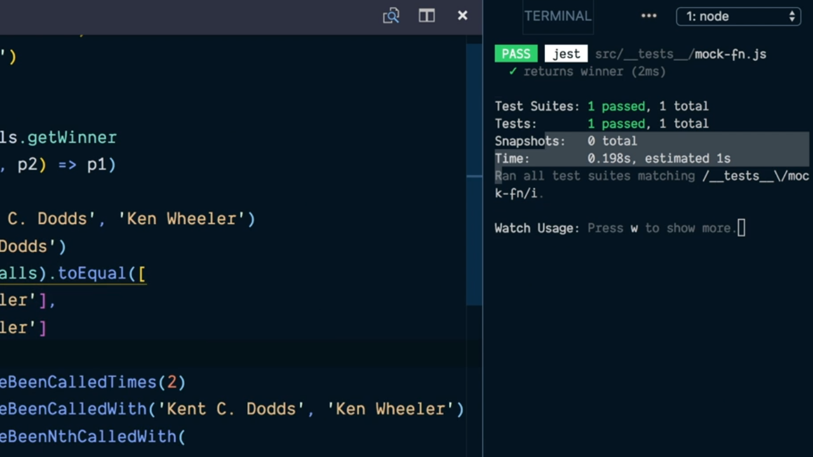
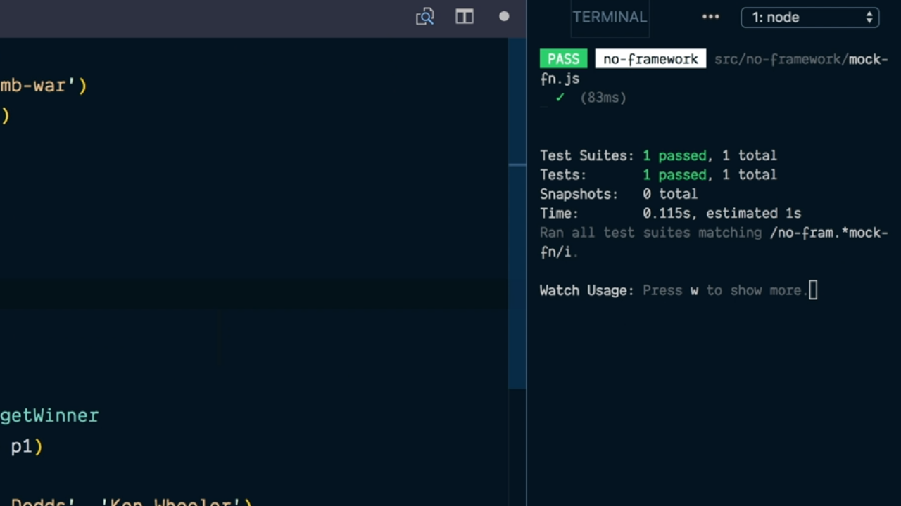
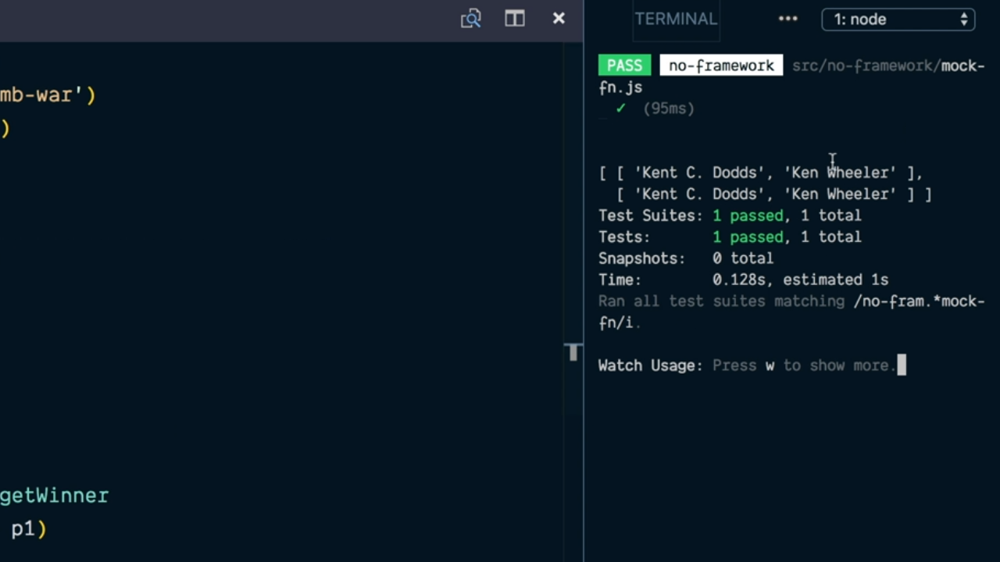
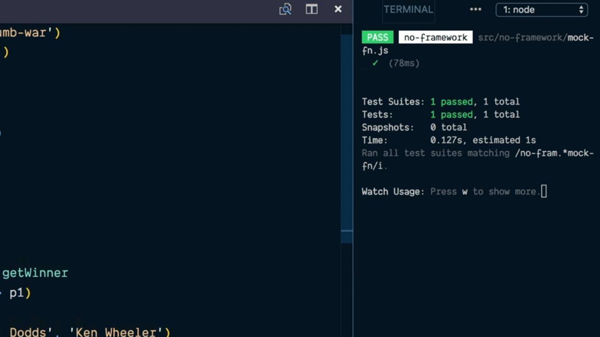

# Ensure Functions Are Called Correctly with JavaScript Mocks.

En el [punto anterior](./03_02.md) hemos visto cómo podemos realizar el mock de una de las funciones que a las que llama el código que queremos probar pero en el esquema que hemos seguido estamos reemplanzando todo el contenidod de la función por otra función totalmente nueva la cual puede, por ejemplo, recibir o no el mismo número de parámetros o retornar algo totalmente diferente. 

¿Con esto qué es lo que queremos decir? Pues para entenderlo bastaría con que se cambiara la invocación de la función `getWinner` dentro del código fuente en nuestro código de ejemplo llamándola con un único parámetro tal y como se muestra a continuación lo cual sería realmente un error porque dicha función (la implementación real de la misma) espera recibir dos parámetros:

```js
while (player1Wins < numberToWin && player2Wins < numberToWin) {
  const winner = utils.getWinner(player1)
  // ...
``` 

Si ejecutamos nuevamente el test que hemos escrito anteriormente también pasará cuando no debería ser así porque no se estará detectando el caso en el que se está llamando a esa función con un único parámetro:

<div style='text-align: center'>
  
</div>
<br />

Cuando estamos trabajando con Jest como librería para realizar nuestros test tenemos que conocer que este nos ofrece un objeto de forma global que se denomina `jest` y dentro del mismo disponemos del método `fn` que espera recibir como parámetro una función, mockeará su comportamiento además de poder llevar el control del número de argumentos con los que es llamada. 

Esto que suena un poco extraño se puede entender mejor si lo aplicamos en nuestro ejemplo donde vamos a reescribir el test que queremos realizar pero en este caso utilizando la función `test` que nos ofrece Jest:

```js
const thumbWar = require('../thumb-war')
const utils = require('../utils')

test('returns winner', () => {
  const originalGetWinner = utils.getWinner
  utils.getWinner = jest.fn((p1, p2) => p1)

  const winner = thumbWar('Kent C. Dodds', ' Ken Wheeler')
  expect(winner).toBe('Kent C. Dodds')

  // Cleanup
  utils.getWinner = originalGetWinner
})
```

En concreto en el código anterior lo que estamos haciendo es seguir una estrategia más o menos similar a la anterior salvo que la utilizamos la función que nos retorna el método `fn` del objeto `jest` para construir el mock que asignaremos como la función que se ha de invocar como substituta (mock) de la función original `getWinner` dentro del módulo `utils`. Además estamos haciendo uso de la función `expect` que también nos proporciona Jest para comprobar que el resultado de la invocación de la función es el que esperábamos invocando sobre el objeto que retorna dicha función (al que le apasamos el resultado que se ha obtenido) `toBe` método que no lanzará un error en el caso de que el resultado obtenido sea igual al resultado esperado.

Una de las características que nos ofrece el hecho de haber creado el mock de la función `getWinner` a través del método `fn` del objeto `jest` es que sobre el propio objeto que representa a la función (el cual hemos de pasarlo como parámetro de la función `expect`) podremos invocar al método `toHaveBeenCalledTimes` pasándole como parámetro el número de veces que se espera haber llamado a la función. Es decir, que escribiremos lo siguinte:

```js
test('returns winner', () => {
  const originalGetWinner = utils.getWinner
  utils.getWinner = jest.fn((p1, p2) => p1)

  const winner = thumbWar('Kent C. Dodds', ' Ken Wheeler')
  expect(winner).toBe('Kent C. Dodds')
  expect(utils.getWinner).toHaveBeenCalledTimes(2)

  // Cleanup
  utils.getWinner = originalGetWinner
})
```

Es decir, que en nuestro caso lo que estamos diciendo es que en la realización de nuestro test esperamos que la invocación de la función `getWinner` del módulo `utils` (que está mockeada) ha de ser llamada dos veces. Es más, podemos ampliar el conjunto de aserciones que realizamos sobre la función mockeada invocando al método `toHaveBeenCalledWith` pasándole como parámetros los argumentos con los que esperamos que se haya invocado a la función. Así escribiremos:

```js
test('returns winner', () => {
  const originalGetWinner = utils.getWinner
  utils.getWinner = jest.fn((p1, p2) => p1)

  const winner = thumbWar('Kent C. Dodds', ' Ken Wheeler')
  expect(winner).toBe('Kent C. Dodds')
  expect(utils.getWinner).toHaveBeenCalledTimes(2)
  expect(utils.getWinner).toHaveBeenCalledWith('Kent C. Dodds', 'Ken Wheeler')

  // Cleanup
  utils.getWinner = originalGetWinner
})
```

Si ahora ejecutamos el test que acabamos de escribir gracias a Jest veremos que se nos informará de un error porque en el código que tenemos no se estará llamando a la función `getWinner` con los parámetros que se esperaba:

<div style='text-align: center'>
  
</div>
<br />

Si ahora modificamos el código de nuestro ejemplo para que efectivamente la función con la que se invoca realmente reciba dos parámetros de la siguiente manera:

```js
while (player1Wins < numberToWin && player2Wins < numberToWin) {
  const winner = utils.getWinner(player1, player2)
  // ...
``` 

Si ahora guardamos nuestro trabajo y volvemos a ejecutar los test veremos que el único que tenemos definido pasa sin problemas ya que se cumplen las tres aserciones que estamos realizando:

<div style='text-align: center'>
  
</div>
<br />

Pero no solamente esto, sino que Jest nos va a permitir hacer aserciones sobre los parámetros con los que se realiza cada una de las llamadas a nuestra función mockeada para lo cual utilizaremos el método `toHaveBeenNthCalledWith` que nos proporciona el objeto que retorna la función `expect` indicándole como primer parámetro el número de la invocación que se quiere testear y el resto de parámetros serán los parámetros que se quieren comprobar. Así en nuestro ejemplo podríamos escribir algo como lo siguiente:

```js
test('returns winner', () => {
  const originalGetWinner = utils.getWinner
  utils.getWinner = jest.fn((p1, p2) => p1)

  console.log(utils.getWinner)

  const winner = thumbWar('Kent C. Dodds', ' Ken Wheeler')
  expect(winner).toBe('Kent C. Dodds')
  expect(utils.getWinner).toHaveBeenCalledTimes(2)
  expect(utils.getWinner).toHaveBeenCalledWith('Kent C. Dodds', 'Ken Wheeler')
  expect(utils.getWinner).toHaceBeenNthCalledWith(1, 'Kent C. Dodds', 'Ken Wheeler')
  expect(utils.getWinner).toHaceBeenNthCalledWith(2, 'Kent C. Dodds', 'Ken Wheeler')

  // Cleanup
  utils.getWinner = originalGetWinner
})
```

Es más completamos el test anterior para que nos escriba por la consola el contenido del objeto que representa a la función que está mockeada tendríamos algo como lo siguiente:

<div style='text-align: center'>
  
</div>
<br />

Vemos por lo tanto que a nivel de JavaScript la función mockeada es en realidad un objeto que representa a una función JavaScript el cual nos proporciona un serie de métodos junto con el atributo `mock`. Si ahora modificamos el código anterior para escribir por la consola qué es lo que tiene este atributo vemos lo siguiente:

```js
test('returns winner', () => {
  const originalGetWinner = utils.getWinner
  utils.getWinner = jest.fn((p1, p2) => p1)

  console.log(utils.getWinner.mock)
```

<div style='text-align: center'>
  
</div>
<br />

Donde podemos ver que valor del atributo `mock` es a su vez un objeto que tiene un atributo `calls` que tiene asignado un array en el que cada uno de los elementos es a su vez un array donde ser guarda la información de los parámetros con los que es llamado cada una de las invocaciones de la función mockeada. Es por ello que podríamos utilizar los valores de este array para realizar alguna aserción más en nuestro test como sigue:

```js
test('returns winner', () => {
  const originalGetWinner = utils.getWinner
  utils.getWinner = jest.fn((p1, p2) => p1)

  const winner = thumbWar('Kent C. Dodds', ' Ken Wheeler')
  expect(winner).toBe('Kent C. Dodds')
  expect(utils.getWinner.mock.calls).toEqual([
    ['Kent C. Dodds', 'Ken Wheeler'],
    ['Kent C. Dodds', 'Ken Wheeler']
  ])
  expect(utils.getWinner).toHaveBeenCalledTimes(2)
  expect(utils.getWinner).toHaveBeenCalledWith('Kent C. Dodds', 'Ken Wheeler')
  expect(utils.getWinner).toHaceBeenNthCalledWith(1, 'Kent C. Dodds', 'Ken Wheeler')
  expect(utils.getWinner).toHaceBeenNthCalledWith(2, 'Kent C. Dodds', 'Ken Wheeler')

  // Cleanup
  utils.getWinner = originalGetWinner
})
```

Si ahora volvemos a ejecutar los test podemos ver que este pasa sin problemas porque se cumplen todo el conjunto de las aserciones que se están contemplando:

<div style='text-align: center'>
  
</div>
<br />

Pero es más, si nos paramos a pensar en lo que representa esta última aserción podemos entender que las cuatro últimas aserciones que hemos escrito no prueban nada nuevo y por lo tanto podremos eliminarlo del test:

```js
test('returns winner', () => {
  const originalGetWinner = utils.getWinner
  utils.getWinner = jest.fn((p1, p2) => p1)

  const winner = thumbWar('Kent C. Dodds', ' Ken Wheeler')
  expect(winner).toBe('Kent C. Dodds')
  expect(utils.getWinner.mock.calls).toEqual([
    ['Kent C. Dodds', 'Ken Wheeler'],
    ['Kent C. Dodds', 'Ken Wheeler']
  ])

  // Cleanup
  utils.getWinner = originalGetWinner
})
```

Ahora que conocemos cómo funciona el método `fn` que nos ofrece el objeto `jest` vamos a realizar nuestra propioa implementación del mismo. Lo primero que tenemos que pensar es que `fn` será una función que va a recibir como parámetro una implementación de una función (la que queremos mockear) por lo que comenzamos definiéndola de la siguiente manera:

```js
function fn(impl) {}
```

Dentro del código de esta función lo que vamos a hacer es crear un nuevo función que ha de contener a la misma implementación que la que se recibe como parámetro pero a la que le vamos a pasar una serie de variable de parámetros con la que queremos invocar a la función que estamos invocando.

```js
function fn(impl) {
  const mockFn = (...args) => {
    impl(...args)
  }
}
```

Por último lo que vamos a hacer es retorna esta función mockeada para que pueda ser utilizada desde el exterior:

```js
function fn(impl) {
  const mockFn = (...args) => {
    impl(...args)
  }
  return mockFn
}
```

Si ahora queremos utilizar esta implementación en el código de partida con el que estamos trabajando escribiremos algo como lo siguiente:

```js
const assert = require('assert')
const thumbWar = require('../thumb-war')
const utils = require('../utils')

function fn(impl) {
  const mockFn = (...args) => {
    impl(...args)
  }
  return mockFn
}

const originalGetWinner = utils.getWinner
utils.getWinner = fn((p1, p2) => p1)

const winner = thumbWar('Kent C. Dodds', 'Kent Wheeler')
assert.strictEqual(winner, 'Kent C. Doods')

utils.getWinner = originalGetWinner
```

Y simplemente comprobamos que este test pasará de forma correcta tal y como esperábamos porque no es maś que una versión similar a como estamos haciendo en Jest para mockear el código de nuetras funciones:

<div style='text-align: center'>
  
</div>
<br />

El siguiente paso consistirá en definir el atributo `mock` tal y como posee el objeto que representa a una función mockeada en Jest y, como hemos visto, este a su vez será un objeto donde uno de sus atributos se denomina `calls` que tendrá un array en el que se almacenarán los parámetros con los que es invocada cada vez la función mockeada. Así pues refinamos nuestra función `fn` para tener esto en cuenta de la siguiente manera:

```js
function fn(impl) {
  const mockFn = (...args) => {
    impl(...args)
  }
  mockFn.mock = { calls: [] }
  return mockFn
}
```

Lo siguiente que tendremos que hacer será insertar un nuevo elemento en este array cada vez que se produzca una invocación de la función y dicho elemento a su vez a de ser un array que contenga la información de los parámetros con los que se ha invocado a la función. Así, modificamos el cuerpo de la función `mockFn` para que lo primero que haga sea guardar la información de los parámetros con los que ha sido llamada cada vez que esta es invocada:

```js
function fn(impl) {
  const mockFn = (...args) => {
    mockFn.mock.calls.push(args)
    impl(...args)
  }
  mockFn.mock = { calls: [] }
  return mockFn
}
```

Si ahora utilizamos esta versión de nuestra función `fn` y además escribimos por la consola la información del objeto que representa a la función mockeada tal y como sigue:

```js
const assert = require('assert')
const thumbWar = require('../thumb-war')
const utils = require('../utils')

function fn(impl) {
  const mockFn = (...args) => {
    mockFn.mock.calls.push(args)
    impl(...args)
  }
  mockFn.mock = { calls: [] }
  return mockFn
}

const originalGetWinner = utils.getWinner
utils.getWinner = fn((p1, p2) => p1)

const winner = thumbWar('Kent C. Dodds', 'Kent Wheeler')
assert.strictEqual(winner, 'Kent C. Doods')
console.log(utils.getWinner)

utils.getWinner = originalGetWinner
```

Al ejecutar de nuevo el test el consola del sistema veremos cómo se está mostrando la información de los parámetros con los que se ha invocado a nuestra función tal y como esperábamos:

<div style='text-align: center'>
  
</div>
<br />

Y esto nos va a permitir realiza una aserción adicional que consista en comprobar los parámetros con los que se ha invocado a la función en cada una de las llamadas gracias a la utilización del método `deepStrictEquals` que nos proporciona el objeto `assert` lo que nos deja el siguiente código final:

```js
const assert = require('assert')
const thumbWar = require('../thumb-war')
const utils = require('../utils')

function fn(impl) {
  const mockFn = (...args) => {
    mockFn.mock.calls.push(args)
    impl(...args)
  }
  mockFn.mock = { calls: [] }
  return mockFn
}

const originalGetWinner = utils.getWinner
utils.getWinner = fn((p1, p2) => p1)

const winner = thumbWar('Kent C. Dodds', 'Kent Wheeler')
assert.strictEqual(winner, 'Kent C. Doods')
assert.deepStrictEquals(utils.getWinner.mock.calls, 
  [
    ['Kent C. Dodds', 'Kent Wheeler'],
    ['Kent C. Dodds', 'Kent Wheeler']
  ]
)
console.log(utils.getWinner)

utils.getWinner = originalGetWinner
```

lo cual hace que nuestro test pase sin problemas como se puede observar en la siguiente imagen lo que nos garantizará no solamente que nuestra función mockeada se ha invocado dos veces sino que además que en cada uno de estas invocaciones los parámetros que se han utilizado son los que se recogen en cada uno de los elementos del array:

<div style='text-align: center'>
  
</div>
<br />

---
**Nota:** para obtener más información acerca de cómo funciona el método `deepStrictEquals` que nos proporciona el objeto `assert` se recomienta leer la [documentación oficial](https://nodejs.org/api/assert.html)

---

<br />

----
<div>
  <div style="float: left">
    <a href="./03_02.md">
      < Override Object Properties to Mock with Monkey Patching
    </a>
  </div>
  <div style="float: right">
    <a href="./03_04.md">
      Jest: Restore the Original Implementation of a Mocked JavaScript Function >
    </a>
  </div>
</div>
