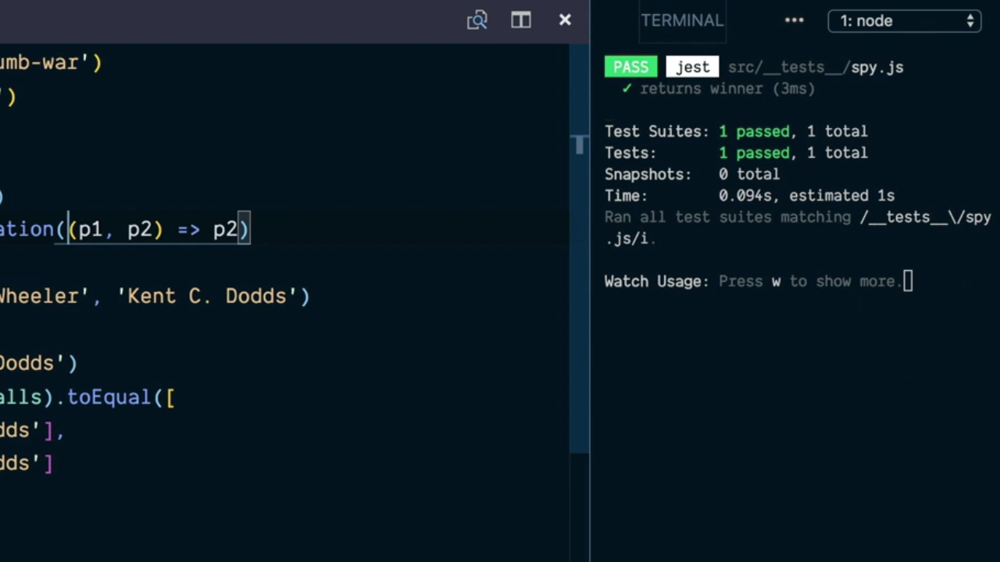

# Jest: Restore the Original Implementation of a Mocked JavaScript Function.

Hasta ahora el mecanismo que estamos siguiendo para utilizar la versión mockeada de una función que obtenemos de un módulo la secuencia que hemos seguido es la siguiente:

```js
const thumbWar = require('../thumb-war')
const utils = require('../utils')

test('returns winner', () => {
  const originalGetWinner = utils.getWinner
  utils.getWinner = jest.fn((p1, p2) => p1)

  const winner = thumbWar('Kent C. Dodds', ' Ken Wheeler')
  expect(winner).toBe('Kent C. Dodds')
  expect(utils.getWinner.mock.calls).toEqual([
    ['Kent C. Dodds', 'Ken Wheeler'],
    ['Kent C. Dodds', 'Ken Wheeler']
  ])

  utils.getWinner = originalGetWinner
})
```

Es decir, que inicialmente hemos capturado la versión original del código que está asociado a la función y la guardamos en una variable, posteriormente mockeamos el comportamiento de la misma pasándole como parámetro el código de la nueva función que substituye a la implementación original asignando esta versión como la función que esta asociada a al módulo. Posteriormente invocamos a la función a probar, realizamos las aserciones sobre dicha invocación y al final del todo lo que hacemos es restaurar el código que está asociado a la función del módulo con el código que originalmente tenía.

Con el fin de no tener que hacer esto y poder utilizar una copia de la versión que tiene implementada la función dentro de la librería el objeto `jest` nos ofrece el método `spyOn` el cual recibirá como primer parámetro el objeto sobre el que queremos trabajar y el segundo parámetro será la función (método) a tener en cuenta pero representada como un string, es decir, que tenemos que precisar únicamente cual es el nombre de la función.

Así queremos aplicar este concepto en nuestro código de ejemplo tendríamos que escribir algo como los siguiente:

```js
test('returns winner', () => {
  jest.spyOn(utils, 'getWinner')
  utils.getWinner = jest.fn((p1, p2) => p1)

  const winner = thumbWar('Kent C. Dodds', ' Ken Wheeler')
  expect(winner).toBe('Kent C. Dodds')
  expect(utils.getWinner.mock.calls).toEqual([
    ['Kent C. Dodds', 'Ken Wheeler'],
    ['Kent C. Dodds', 'Ken Wheeler']
  ])

  utils.getWinner = originalGetWinner
})
```

Con esto lo que estaremos haciendo es guardar una copia original de la función `getWinner` del objeto `utils` pero en este caso será la propia librería Jest quien se encargará de guardarla. La siguiente pregunta que surge es ¿cómo haremos ahora para restaurarla? La respuesta es que ahora el objeto que representa a la función `getWinner` del objeto `utils` es igual que el objeto que representaba a la función original con la salvedad que se le habrán añadido una serie de atributos y métodos adicionales como consecuencia de haber invocado a la función `spyOn` sobre el mismo. Entre estos métodos está `mockRestore` que al ser invocado servirá para recuperar la versión original de la función antes haberle asignado la versión mockeada de la misma. Por lo tanto la última línea de la función que forma nuestro test será algo como lo siguiente:

```js
test('returns winner', () => {
  jest.spyOn(utils, 'getWinner')
  utils.getWinner = jest.fn((p1, p2) => p1)

  const winner = thumbWar('Kent C. Dodds', ' Ken Wheeler')
  expect(winner).toBe('Kent C. Dodds')
  expect(utils.getWinner.mock.calls).toEqual([
    ['Kent C. Dodds', 'Ken Wheeler'],
    ['Kent C. Dodds', 'Ken Wheeler']
  ])

  utils.getWinner.mockRestore()
})
```

Pero no solamente esto sino que al haber invocado a la función `spyOn` sobre la función `getWinner` otro de los métodos que tenemos a nuestra disposición será `mockImplementation` el cual espera recibir como parámetro una función que represente a la versión mockeada de la función `getWinner` lo que simplica todavía un poco más nuestro código ya que nos ahorra la llamada al método `fn` del objeto `jest` dejando el código como sigue:

```js
test('returns winner', () => {
  jest.spyOn(utils, 'getWinner')
  utils.getWinnser.mockImplementation((p1, p2) => p1)

  const winner = thumbWar('Kent C. Dodds', ' Ken Wheeler')
  expect(winner).toBe('Kent C. Dodds')
  expect(utils.getWinner.mock.calls).toEqual([
    ['Kent C. Dodds', 'Ken Wheeler'],
    ['Kent C. Dodds', 'Ken Wheeler']
  ])

  utils.getWinner.mockRestore()
})
```

Si ahora ejecutamos nuestro test desde la terminal del sistema veremos que este seguirá pasando sin problemas:

<div style='text-align: center'>
  
</div>
<br />

Como hemos hecho anteriormente vamos a ver cómo podemos implementar nuestra propia versión de la función `spyOn` que nos proporciona Jest. La función `spyOn` va a recibir dos parámetro para su implementación siendo el primero de ellos un objeto y el segundo una *prop* del mismo (entendiendo como prop una atributo o método del mismo):

```js
function spyOn(object, prop) {}
```

Dentro del código de esta función lo primero que tenemos que hacer es guardar cuál es valor que actualmente tiene el objeto en dicha prop ya sea este el código de una función o el valor de un atributo. Esto lo conseguiremos de la siguiente manera:

```js
function spyOn(object, prop) {
  const originalValue = object[prop]
}
```

Lo siguiente que vamos a hacer es mockear, es decir, establecer un valor por defecto para la prop para lo cual nos vamos a apoyar en la implementación de la función `fn` que hemos realizado anteriormente y que recordemos que es la siguiente:

```js
function fn(impl) {
  const mockFn = (...args) => {
    mockFn.mock.calls.push(args)
    impl(...args)
  }
  mockFn.mock = { calls: [] }
  return mockFn
}
```

Así, establecemos como valor de la prop la versión mockeada de la propiedad de la siguiente manera:

```js
function spyOn(object, prop) {
  const originalValue = object[prop]
  object[prop] = fn()
}
```

Sin embargo aquí tenemos el problema de que la versión que tenemos que implementada de nuestra función `fn` espera recibir como parámetro la función con la que se va a realizar el mock pero dentro del `spyOn` no sabemos cuál es este código. ¿Cómo podemos solucionarlo? Pues simplemente haciendo uso de los parámetros por defecto que nos proporciona JavaScript y haciendo que como implemetación por defecto de una prop sea la función vacía (un función que no realiza nada en su interior):

```js
function fn(impl = () => {}) {
```

Lo siguiente que vamos a hacer es añadir el método `mockRestore` de tal manera que al ser invocado nos permita recuperar la implementación que originalmente tenía la función por lo que hacemos que sea igual a una arrow function en el que donde se restablece el valor de la propidad del objeto:

```js
function spyOn(object, prop) {
  const originalValue = object[prop]
  object[prop] = fn()
  object[prop].mockRestore = () => { object[prop] = originalValue }
}
```

Para poder implemenar el método `mockImplementation` que nos proporciona Jest con la función `spyOn` lo primero que vamos a hacer es crear un nuevo método dentro del objeto que retorna la función `fn` que al ser invocado nos permita cambiar la implementación de la función que está siendo mockeada por la que esta función recibe como parámetro. Así pues escribimos lo siguiente:

```js
function fn(impl) {
  const mockFn = (...args) => {
    mockFn.mock.calls.push(args)
    impl(...args)
  }
  mockFn.mock = { calls: [] }
  mockFn.mockImplementation = newImpl => { impl = newImpl }
  return mockFn
}
```

A modo de resumen a continuación se muestra el código completo que recoge nuestra implementación de las funcione `fn` y `spyOn` que ofrecen la misma funcionalidad que sus homónimas en Jest.

```js
const assert = require('assert')
const thumbWar = require('../thumb-war')
const utils = require('../utils')

function fn(impl = () => {}) {
  const mockFn = (...args) => {
    mockFn.mock.calls.push(args)
    impl(...args)
  }
  mockFn.mock = { calls: [] }
  mockFn.mockImplementation = newImpl => { impl = newImpl }
  return mockFn
}

spyOn(utils, 'getWinner')
utils.getWinnser.mockImplementation((p1, p2) => p1)

const winner = thumbWar('Kent C. Dodds', ' Ken Wheeler')
expect(winner).toBe('Kent C. Dodds')
expect(utils.getWinner.mock.calls).toEqual([
  ['Kent C. Dodds', 'Ken Wheeler'],
  ['Kent C. Dodds', 'Ken Wheeler']
])

utils.getWinner.mockRestore()
```

<br />

----
<div>
  <div style="float: left">
    <a href="./03_03.md">
      < Ensure Functions Are Called Correctly with JavaScript Mocks
    </a>
  </div>
  <div style="float: right">
    <a href="./03_05.md">
      Jest: Mocked a JavaScript Module in a Test >
    </a>
  </div>
</div>
