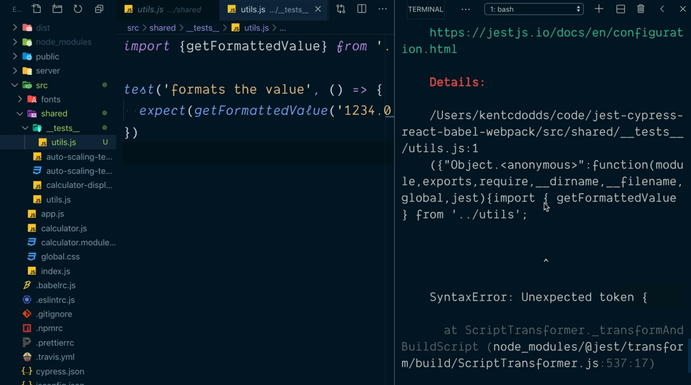
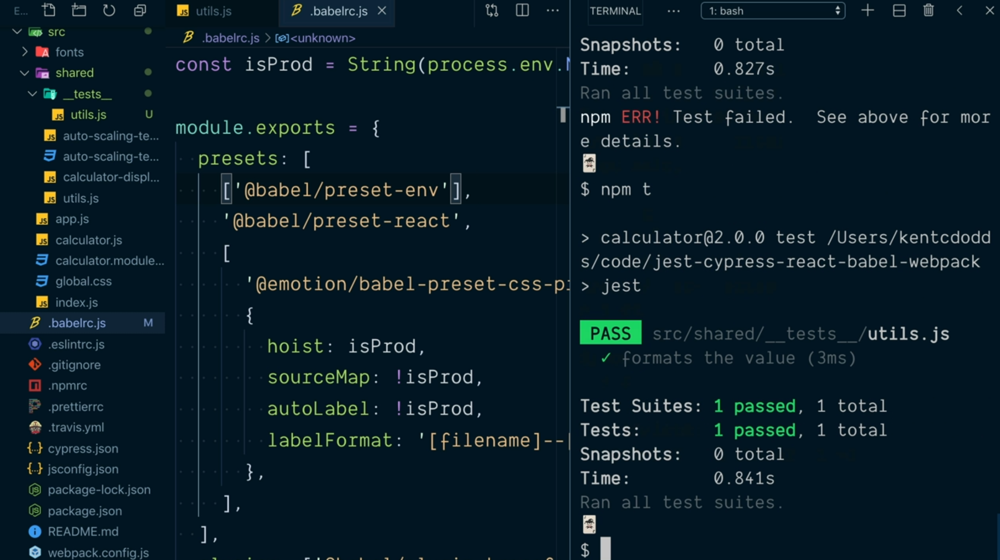

# Compile Modules with Babel in Jest Test.

En nuestro proyecto de ejemplo tenemos definido el directorio `shared` dentro de `src` en el que recogemos una serie de utilidades que van a ser compartidas a lo largo de la aplicación que estamos desarrollando. Dentro de este directorio tenemos el fichero `utils.js` el cual contiene una serie de funciones que vamos a probar con nuestros test.

Vamos a suponer que como equipo de desarrollo hemos optado por seguir la opción de configuración de Jest que hace que los test estén situados en cualquier subdirectorio de la aplicación se llame`__tests__` por lo que creamos dicho subdirectorio dentro de `shared` y dento del mismo el fichero `utils.js` que contendrá todos los test sobre las funciones del fichero homónimo situado en `shared`:

```js
import { getFormattedValue } from '../utils'

test('formats the value', () => {
  expect(getFormattedValue('1234.0')).toBe('1,234.0')
})
```

Aunque hemos seguido todas las opciones de configuración para Jest nos encontramos con el problema de que cuando vamos a ejecutarlos no funcionarán porque la librería se encuentra un token de compilación inesperado:

<div style='text-align: center'>
  
</div>

La razón de ello es que Jest se está ejecutando utilizando NodeJS y este entorno de ejecución no soporta la instrucción `import` por lo que tendremos que actualizar nuestras opciones de compilación para que pueda trabajar con ellas.

Ya hemos visto que para crear el bundle de nuestro proyecto estamos utilizando Webpack herramienta que entiende las instrucciones `import` por defecto. Además, en el fichero `webpack.config.js` donde tenemos descritas sus opciones de configuración aparece la siguiente regla:

```js
module.exports = {
  // ... otras opciones de configuración.
  rules: [
    {
      test: /|.js$/,
      exclude: 'node_modules',
      use: 'babel-loader'
    }
    // Otras reglas de configuración.
  ]
}
```

Es decir que le estamos indicando a Webpack que todos los ficheros que acaben en la extensión `.js` han de utilizar el transpilador Babel para obtener el código JavaScript que formará nuestro entregable permitiendo de esta manera que aunque estemos utilizando características más modernas de JavaScript estas puedan ser ejecutadas en versiones más antiguas de los navegadores.

Para poder hacer que nuestros test entiendan las sentencias `ìmport` con las que estamos trabajando tendremos por lo tanto que fijarnos en las opciones que tenemos asociadas a Babel, las cuales están recogidas en el fichero `.babel.rc`.

Si nos fijamos en el contenido de este fichero y más concretamente en el elemento `presets` del mismo, cuando estamos estableciendo el preset `@babel/preset-env` lo que estamos indicando en el objeto que se le pasa como parámetro es que no compile los módulos razón por la que tenemos el problema:

```js
// Otras opciones previas.
module.exports = {
  presets: [
    ['@babel/preset-env', { modules: false }],
    // resto de presents para el proyecto.
  ],
  // resto de opciones de compilación.
}
```

Así, la solución es tan simple como eliminar esta configuración de no compilar los modulos dejando lo siguiente:

```js
// Otras opciones previas.
module.exports = {
  presets: [
    ['@babel/preset-env',
    // resto de presents para el proyecto.
  ],
  // resto de opciones de compilación.
}
```

Y si ahora tratamos de ejecutar de nuevo los test de nuestra aplicación veremos que el problema queda resuelto y los test pasan correctamente:

<div style='text-align: center'>
  
</div>

Con esto habremos conseguido que nuestros test interpreten perfectamente las sentencias `ìmport` pero nos hemos cargado los beneficios de aplicar las características de lo que se conoce como [tree shaking](https://webpack.js.org/guides/tree-shaking/) lo que hace que el tamaño de nuestro entregable sea mayor.

Entonces ¿qué solución podemos adoptar para, por una parte poder utilizar las sentencias `import` dentro del código de nuestros test y por otra parte poder hacer uso del tree shaking de Webpack? La solución pasa por adoptar una variable de entorno de ejecución que nos indique cuando estamso ejecutando los test y cuando no.

```js
// Otras opciones previas.
const isTest = String(process.env.NOVE_ENV) === 'test'
```

Escribiendo lo anterior en el fichero `.babel.rc` antes de indicar qué es lo que estaremos exportando ya sabermos si se estamos ante el entorno de ejecución de test o no.

Ahora, como sabemos que Jest utilizar NodeJS para trabajar también es necesario que saber que si queremos hacer uso de las sentencias `import` el sistema de módulos de JavaScript que deberemos utilizar será `CommonJS` y así se lo tendremos que asignar como posible valor al atributo `modules`:

```js
// Otras opciones previas.
const isTest = String(process.env.NOVE_ENV) === 'test'
module.exports = {
  presets: [
    [
      '@babel/preset-env',
      {
        modules: isTest ? 'commonjs' : false
      }
    ],
    // resto de presents para el proyecto.
  ],
  // resto de opciones de compilación.
}
```

Si ahora volvemos a guardar la nueva configuración y ejecutamos de nuevo los test vermos que el error que teníamos inicialemente habrá desaparecido ya que NodeJS (y por lo tanto Jest) van a poder utilizar las sentencias `import` de forma correcta.

<div style='text-align: center'>
  
</div>

Acabamos de ver cómo Jest toma por defecto las opciones que hayamos descrito en el fichero `.babel.rc` para realizar la transpilación del código recogido en los test que escribamos en nuestros proyectos lo que hace que sea muy sencillo utlizarlo rápidamente sin tener que realizar demasiadas opciones de configuración.

Y no solamente eso sino que además cuando se está invocando al CLI de Jest este establece por defecto la variable de entorno `NODE_ENV` al valor `test` permitiéndonos realizar al comparación que hemos visto anteriormente.
