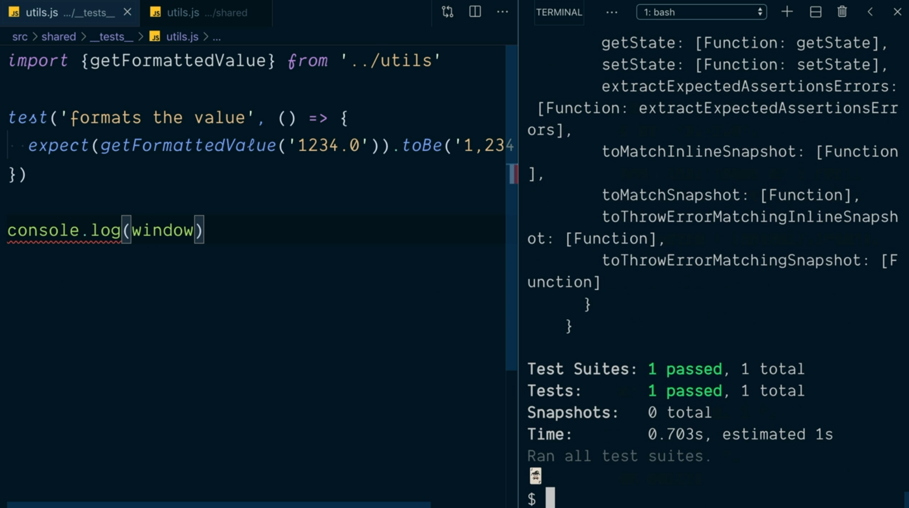
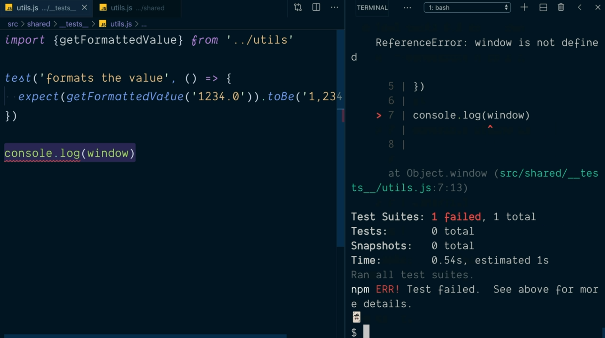
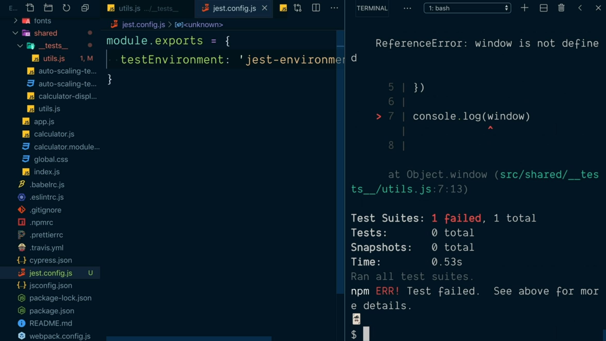
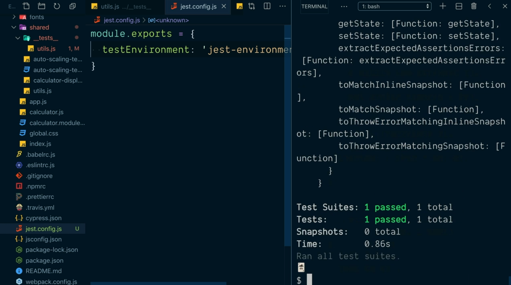

# Configure Jest's Test Enviroment for Testing Node or Browser Code.

En el punto anterior hemos visto cómo Jest se apoya en NodeJS para ejecutar su código pero entonces ¿cómo es posible realizar los test sobre el código JavaScript que se ejecuta en el navegador con esta librería? La respuesta es que Jest utiliza un módulo denominado [jsdom](https://github.com/jsdom/jsdom).

Esto quiere decir que si dentro de uno de los archivos con los test escribimos una instrucción en la que accedemos al objeto `window` que está disponible de forma nativa en el navegador:

```js
test('', () => {
  // ...
})
console.log(window)
```

Si ahora ejecutamos el test anterior obtendremos un error porque dentro de NodeJS no vamos a tener acceso al objeto `window` propio de un navegador, como tampoco tendremos el objeto `document`, etc.

<div style='text-align: center'>
  
</div>

En el proyecto que estamos desarrollando el conjunto de utilidades que tenemos recogidas en el fichero `utils.js` no depende de si nuestro código se está ejecutando en el navegador o no por lo que podemos ver si los test que hemos construido sobre las funciones que están dentro de este fichero tienen algún problema de rendimiento como consecuencia del tipo de entorno de ejecución sobre el que se está ejecutando.

Ahora bien qué sucede en el caso de que tengamos que incluir una instrucción que es propia de un del navegador. Siguiendo con nuestro ejemplo ¿qué sucería en el caso de que nuestro test contuviese el siguiente código?

```js
import { getFormattedValue } from '../utils'

test('formats the value', () => {
  expect(getFormattedValue('1234.0')).toBe('1,234.0')
})

console.log(window)
```

Por defecto el entorno de ejecución sobre el que queremos que corran nuestro test es NodeJS pero esto se lo podemos indicar de forma explícita indicando una variable de ejecución `env` cuando estamos invocando el script npm que vamos a ejecutar de la siguiente manera:

```console
$ npm t -- --env=node
```

Como resultado de la ejecución anterior vemos que el error que obtenemos por la pantalla nos describe que se está intentando acceder a un objeto que no está definido en el entorno de ejecución de NodeJS:

<div style='text-align: center'>
  
</div>

La razón por la que se produce el error es porque al indicarle que estamos estableciendo como entorno de ejecución NodeJS Jest lo que hace es excluir la utilización de la librería jsdom y por lo tanto no tendremos acceso a los objetos que son propios del navegador.

Si estamos seguros de que nuestros test han de ser ejecutados excluisavemente para el código NodeJS podemos establecer siempre este flag a la hora de invocar al script de npm lo que hará que ganemso en el rendimiento de ejecución de todos los test (en una aplicación grande se notará) pero es cierto que el tener que estar invocando en todo momento al script con este flag puede llegar a ser tedioso.

¿Qué podemos hacer en este escenario? La respuesta pasa por definir el fichero de configurarión `jest.config.js` en el directorio raíz de nuestro proyecto ya que es el fichero que por defecto va a leer Jest para establercer y sobreescribir cualquier opción de configuración por defecto. Este fichero ha de exportar un objeto en el que en sus atributos estableceremos las opciones de configuración.

Así, en el caso de que queramos indicar que nuestro código de test está diseñado para ser ejecutado en un entorno de NodeJS establecermos el atributo `testEnvironment` de la siguiente manera:

```js
module.exports = {
  testEnvironment: 'jest-environment-node'
}
```

De esta manera ahora podemos invocar directamente al script npm:

```console
$ npm t
```

Y obtener el mismo error que en el caso anterior informándonos de que no existe el objeto `window` en el entorno de ejecución sobre el que correrán nuestros test:

<div style='text-align: center'>
  
</div>

Aunque por defecto está incluido jsdom en la ejecución de nuestros test siempre podemos estblecer el valor del atributo `testEnvironment` de forma específica para que lo incluya de la siguiente manera:

```js
module.exports = {
  testEnvironment: 'jest-environment-jsdom'
}
```

Y si ahora volemos a ejecutar el script npm:

```console
$ npm t
```

Todos los test que hemos definido pasarán sin problemas porque el objeto `window` estará disponible de forma global gracias a jsdom:

<div style='text-align: center'>
  
</div>

---
**Nota:** aunque no se trata de una práctica que esté muy extendida dentro de los equipos de desarrollo se recomienda crear el fichero de configuración `jest.config.js` en el que indiquemos siempre el `testEnvironment` sobre el que se ejecutarán nuestros test aunque se vaya a utilizar la opción por defecto que sabemos que es jsdom.

La razón de esto es porque puede que en una versión posterior de Jest se decida cambiar el comportamiento en lo que respecta a los objetos globales del navegador, actualicemos nuestro proyecto y por lo tanto dejen de pasar los test.

---
**Nota:** los valores `jest-enviroment-node` y `jest-environment-jsdom` son dos librerías que podemos encontrar dentro del directorio `node_modules` de nuestra aplicación las cuáles son instaladas por defecto cuando hacemos la instalación de Jest.

Evidentemente existen otros entornos de ejecución que se pueden instalar en nuestra aplicación si es que no nos valiese ninguno de los dos que nos proporciona Jest (lo que sería algo muy raro) y es gracias al valor que establecemos en el atributo `testEnvironment` donde tendremos que indicárselo a Jest.

---
